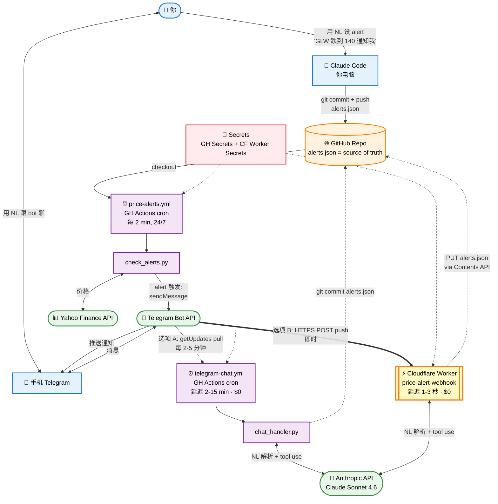

# 介绍 — 这是个什么 Repo？

> 5 分钟读完，看看这个东西是不是给你用的。

[English Version](./INTRODUCTION.md)

---

## 这是什么

一套给 [Claude Code](https://docs.claude.com/claude-code)（Anthropic 官方 AI 编程助手）用的**投资分析 skills**。装上之后，你用大白话（中文或英文）跟 Claude 说话，它就能拉实时市场数据、深度分析个股、筛选投资标的、做财报前准备、审计你的组合 —— 全部用基金经理级的纪律。

它**不是交易机器人**。它是个**思考伙伴**：拉实时数据、跑系统化框架、给你有观点的判断 —— 帮你**更快做出更好的决策**。

---

## 你能问它什么

不用记命令，直接说话就行。几个真实例子：

```
你: "分析一下 NVDA"
→ Claude 拉 NVDA 的宏观环境、估值、内部交易、催化剂，给你 3 档入场计划
  + LEAPS 期权建议。

你: "宏观警报"
→ Claude 扫 8 层指标（NDX P/E、VIX、F&G、信用利差、宽度、日元套息、
  板块轮动、CTA 流），给出 regime 标签 + 具体仓位建议。

你: "审一下我的组合"（贴张截图）
→ Claude 算单股集中度、风格因子暴露、对冲有效性，给你减仓清单
  （含 $ 数额 + 理由）。

你: "AMD 财报前怎么看"
→ Claude 拉 implied move、过去 8 季度反应、4 个情景，给你
  hold/trim/hedge 建议（针对你的仓位定制）。

你: "find untapped AI Power names"（英文：找未爆发的 AI 电力股）
→ Claude 筛 forward P/E 低 + 1 年涨幅落后 + 具体催化剂 + 机构持仓低，
  返回 top 3 候选。
```

系统**中英文都懂**，对话中可以随时切换。

---

## 为什么有这个东西

市面上的投资 AI 工具大致两个极端：

1. **全自主机器人** — 黑箱、过度自信、经常出错、难以审计
2. **通用聊天机器人** — 答案肤浅、数字幻觉、没有实时数据

这个 repo 走中间路径：

- **实时数据**，不是训练数据 —— 每个回答都从 yfinance / FRED / openinsider 实时拉取
- **关键路径上确定性 Python**（内部交易分析、宏观评分）—— 可审计、可测试、可复现
- **有观点的框架**，把昂贵的教训编进了规则（内部交易规则来自真实的踩坑，宏观阈值来自真实的周期）
- **Top-Down 纪律** —— 宏观先于个股、regime 先于加仓、估值先于动量
- **天生双语** —— 每个触发短语都有中英文双版本

---

## 13 个 Skills（一句话简介）

| Skill | 干什么 |
|---|---|
| `analyze-stock` | 10 步深度分析任何美股 |
| `macro-risk-check` | 新闻驱动的每日宏观扫描（VIX、收益率、USDJPY） |
| `macro-warning` | 8 层批量模式顶部预警（CAPE、F&G、宽度、板块） |
| `find-alpha` | 每周 3 时间维度筛选（swing / position / LEAPS） |
| `find-untapped-thesis` | "下一个 NOK" 筛选 —— 主题内未爆发的低估标的 |
| `narrative-reversal-screen` | 跌透但故事还在的标的，找底部 |
| `sector-rotation-analysis` | 11 板块热力图 + 轮动配对 |
| `earnings-prep` | 财报前：implied move、情景、hold/trim/hedge 决策 |
| `leaps-screen` | 长期期权选行权价 + 收益率数学 |
| `option-wall-analysis` | Max pain + gamma 墙（短期支撑阻力） |
| `portfolio-audit` | 集中度/因子/期权 Greeks/压力测试 |
| `tax-optimize` | LTCG vs STCG 决策（含州税逻辑） |
| `review-investment-screenshot` | 截图组合速读 |
| `price-alert` | 参数化价格 alert，GitHub Actions + Telegram 推送（任何标的、任何阈值/百分比）。一次性 bot 设置见 [SETUP-zh.md](./price-alert/SETUP-zh.md) |

加上底层共享脚本：
- `insider_ratio.py` — Form 4 代码感知的内部交易分析
- `cluster_buy_scan.py` — 全市场 cluster buy 扫描
- `macro_pull.py` — 直接 API 宏观指标拉取
- `max_pain.py`、`option_walls.py`、`quote_pull.py` — 期权工具

---

## 安装（3 分钟）

需要：macOS 或 Linux、Python 3.9+、已装 [Claude Code](https://docs.claude.com/claude-code/install)。

```bash
# 1. Clone 到 Claude Code 的 skills 目录
git clone https://github.com/ssurmic/claude-investment-skills.git ~/.claude/skills

# 2. 跑 setup（建 Python venv，装 yfinance，验证一切）
bash ~/.claude/skills/setup.sh

# 3. 跟 Claude 聊
# 打开 Claude Code，直接说：
分析一下 NVDA
```

完事。setup 脚本会验证所有 13 个 skills + 工具脚本都在位。

---

## 自然语言 → Skill 的"魔法"

你**不需要**打 slash 命令。直接说话就行。原理：

1. **每个 skill 的 `description:` 字段**列了触发短语（中英文都有）。
2. **Claude Code 会拿你的输入**去匹配所有 skill descriptions，挑最匹配的。
3. **匹配上的 skill 加载完整 instructions** 并执行（拉数据、跑分析、返回答案）。

比如 `macro-warning` skill 的描述里写了：
```
Triggers in English ("macro warning", "regime check", "is the market at peak",
"should I take profits", "is it time to buy") or Chinese ("宏观警报",
"市场是不是顶了", "该不该减仓", "regime 怎么样", "该入场吗")
```

所以**这些任意一种说法**都会触发同一个 skill。你不必记精确措辞。**接近就行**，太模糊 Claude 会反问。

**组合短语**也行：
- "我想在财报前买 AMD，宏观安全吗？" → 依次触发 `macro-risk-check` + `earnings-prep`。

完整映射在 [`AGENT-TOOL-REFERENCE.md`](./AGENT-TOOL-REFERENCE.md)。

---

## 🏗️ 完整系统怎么工作 —— 架构图（进阶）

如果你启用了可选的 `price-alert` skill（Telegram bot + Anthropic API），整个系统是这样。**chat 路径有两种可互换的实现**（按你要的延迟挑一个）；**价格扫描路径**永远一样。



### ⏱️ Webhook 为什么快 100-300 倍

两条路径处理的是**同一条 Telegram 消息、同一个 Claude 模型、最终改的也是同一个 `alerts.json`**。区别只在于 **worker 进程怎么知道"有新消息要处理了"**：

| 维度 | 选项 A (GH Actions polling) | 选项 B (CF Worker webhook) |
|---|---|---|
| 触发模型 | **Pull** —— cron 定期主动问 Telegram"有新消息吗" | **Push** —— Telegram 一收到消息立即 POST 到一个 URL |
| 最小粒度 | 标榜 1 分钟 cron，高峰时被合并到 5-15 分钟 | 即时，无 schedule |
| 冷启动 | 启动 Ubuntu VM (~10-30 秒) + 装 Python 依赖 (~5-10 秒) | V8 isolate (~50 毫秒，全球预热) |
| 并发 | 串行 —— 一次跑一个 cron job | 并行 —— Workers 可同时处理几千个并发请求 |
| 在哪跑 | Microsoft Azure 数据中心（GH Actions runners） | Cloudflare 全球 300+ 边缘节点（离用户最近的）|
| 代码语言 | Python（`chat_handler.py`） | TypeScript（`webhook/worker.ts`） |
| 状态存储 | 一样 —— GitHub `alerts.json`，通过 Contents API 或 `git commit` | 一样 —— GitHub `alerts.json`，通过 Contents API |

**净效果**：2-15 分钟 → 1-3 秒。模型一样、alert 一样、API 调用费一样 —— 只是触发事件的传输方式不同。

**类比**：polling 像每 5 分钟去信箱看一眼有没有信；webhook 像门铃响了。

### 💰 每月成本估算

| 组件 | 费用 | 说明 |
|---|---|---|
| **GitHub repo**（public）| **$0** | 免费 —— public repo 无限 |
| **GitHub Actions**（public repo）| **$0** | 免费无限分钟；`price-alerts.yml` 每 2 min ≈ 720 min/月 都免费 |
| **GitHub Actions**（private repo）| **~$0-$70/月** | 免费配额 2000 min/月；每次 cron ≈ 0.5-1 计费分钟。`*/5 * * * *` 24/7 ≈ 4320 min/月。保持 public 就是 $0 |
| **Cloudflare Workers**（可选 webhook）| **$0** | 免费层 = 10 万 req/天。个人日常用 ≈ 50-500/天 → 用了 <1% 的额度 |
| **Telegram Bot API** | **$0** | 永久免费，没碰过 quota |
| **Yahoo Finance**（via yfinance + chart JSON）| **$0** | 公开 API，不用 key |
| **Claude Code**（NL 设 alert）| **$0** | 你的 Pro/Max 订阅覆盖 |
| **Anthropic API**（chat 路径）| **~$0.5–$5/月** | 见下面细分 —— polling 和 webhook 一样的钱 |

**Anthropic API 成本细分**（Claude Sonnet 4.6 @ $3/M input, $15/M output）：

每条 Telegram 消息处理 ≈ 700 input + 150 output tokens = **~$0.004 一条消息**

| 你的用量 | 每月费用 |
|---|---|
| 闲置（0 条/天）| $0 —— 没消息就不调 Claude（两种路径都是）|
| 轻度（5 条/天）| ~$0.60/月 |
| 中度（30 条/天）| ~$3.60/月 |
| 重度（100 条/天）| ~$12/月 |

**建议**：$5 充值够中度用法 ~2 个月。可以设 auto-reload（balance 低于 $5 时自动充）省心。

**省钱 tip**：只有 chat 路径（`chat_handler.py` polling 或 `webhook/worker.ts`）调 Claude API。如果你**只要单向 alert**（不要 bot 对话），整个 chat 路径都不启 —— 永远 $0。`price-alerts.yml` 价格扫描完全不碰 AI。

---

### GitHub Actions 做了什么

**GitHub Actions** 本质上是 **Microsoft 提供的 cron-as-a-service**（他们买了 GitHub）。它在他们数据中心**免费**按时间表跑你的 Python 脚本，**不需要自己管理服务器**。

我们最多用它跑**两个任务**：

| Workflow | Cron | 干什么 | 费用 |
|---|---|---|---|
| `price-alerts.yml` | 每 2 分钟，24/7 | 读 `alerts.json` → 拉价格 → 触发就推 Telegram | $0（public repo 免费） |
| `telegram-chat.yml`（仅选项 A）| 每 2-5 分钟，24/7 | poll Telegram 新消息 → Claude API 解析 → 执行工具 → 回复 | ~$1-2/月（Anthropic API） |

每次 cron 触发，它会启动一个新的 Ubuntu 容器、装 Python 依赖、跑脚本、把状态变化 commit 回 repo、然后关闭。每次大约 30 秒。

如果你选了选项 B（webhook）做 chat 路径，就关掉 `telegram-chat.yml`，由 CF Worker 处理所有 chat —— `price-alerts.yml` 继续独立运行做价格扫描。

### Cloudflare Workers 做了什么（仅选项 B）

**Cloudflare Workers** 是一个 serverless 平台，在 Cloudflare 全球边缘网络（~300 个 POPs）上跑 JavaScript / TypeScript。`price-alert/webhook/worker.ts` 通过 `wrangler deploy` 上传，部署完后可以从 `https://price-alert-webhook.<你的-subdomain>.workers.dev` 访问。

当你的 Telegram bot 收到消息，**Telegram 不需要等 cron 轮询，而是立即 HTTP POST** 到那个 worker URL。V8 isolate 在 ~50 毫秒内启动（没有容器、没有语言运行时要加载），调 Claude、通过 GitHub Contents API 更新 `alerts.json`、回复 —— 总耗时 1-3 秒。

技术细节：
- **运行时**：V8 isolate（比 Node.js 进程轻量；和 Chrome 同款引擎）
- **代码**：`webhook/worker.ts` 约 250 行 TypeScript
- **部署**：`wrangler` CLI（`npm install -g wrangler`）
- **Secrets**：`wrangler secret put NAME` —— 加密，设置后不再显示
- **日志**：`wrangler tail` 实时流日志；CF dashboard 保留 7 天
- **费用**：免费层 10 万 req/天。你日常用 <500/天。**好几年都免费**。

### 每个组件干啥

| 组件 | 角色 | 在哪 | 谁付钱 |
|---|---|---|---|
| **Claude Code** | NL 设 alert + 组合分析 | 你电脑 | 免费（Pro/Max 订阅）|
| **GitHub repo** | 配置 + 脚本 + `alerts.json` 的 source of truth | github.com/你/claude-investment-skills | 免费（public repo） |
| **GitHub Contents API** | Worker 用这个读写 `alerts.json`（PUT/GET 配 sha）| api.github.com | 免费（认证后 5000 req/小时） |
| **GitHub Secrets** | GH Actions 的加密凭证存储 | github.com/你/.../settings/secrets | 免费 |
| **GitHub Actions** | Cron 调度 + Python runner（价格扫描 + 选项 A chat）| Microsoft 数据中心 | public repo 免费 |
| **Cloudflare Workers**（可选）| Serverless V8 isolate，处理 Telegram webhook POST（选项 B chat）| Cloudflare 全球 ~300 边缘节点 | 免费 10 万 req/天以内 |
| **wrangler**（可选）| 部署 / 管理 worker + secrets 的 CLI | 你电脑（`npm install -g`）| 免费 |
| **yfinance** | `check_alerts.py`（Python）拉实时股价 | Yahoo Finance API | 免费，无 key |
| **Yahoo chart JSON** | Worker 直接调 `query1.finance.yahoo.com/v8/finance/chart/`（不用 Python 依赖）| Yahoo Finance API | 免费，无 key |
| **Telegram bot** | 推送通知 + NL 聊天 | 你的 `@YourBotName_bot` | 免费 |
| **Anthropic API** | 把 Telegram 消息解析成 tool call（两种 chat 路径都用） | api.anthropic.com | ~$1-2/月（casual 用） |

### 什么时候跑啥

```
你用 Claude Code 设 alert         → 0 延迟（立即 commit + push）
                                  ↓
Cron tick (每 15 分钟)            → 最多等 15 分钟下一次检查
                                  ↓
价格条件满足                       → ~1 秒 yfinance 拉数据
                                  ↓
Telegram POST                     → ~200ms
                                  ↓
📱 你手机响                       → ~1 秒推送送达

端到端: alert 在实际价格穿过后 0-15 分钟内触发
```

### AI / LLM 在哪干活？

| 位置 | LLM 参与 |
|---|---|
| Claude Code（你终端）| ✅ 完整 Claude 解析 NL 帮你设 alert |
| `check_alerts.py`（价格扫描）| ❌ 零 AI —— 纯 Python `if price <= threshold` |
| `chat_handler.py`（Telegram 聊天）| ✅ Claude Sonnet 4.6 via Anthropic API（可选）|
| Telegram 推送 | ❌ 零 AI —— 就是 HTTP POST |

**关键洞察**: "智能"只存在**两个地方** —— Claude Code（你终端，Pro 订阅免费）和可选的 `chat_handler.py`（Anthropic API，~$1-2/月）。**Cron 基础设施本身是哑管道**。

### 安全模型

| 项目 | 在哪 | 可见性 |
|---|---|---|
| Anthropic API key | `.env`（本地）+ GitHub Secrets（加密）| 只有你能解密 |
| Telegram bot token | 同上 | 同上 |
| chat_id | 同上 | 同上 |
| `alerts.json` | commit 到 public repo | 公开但**没敏感信息**（只是 `{ticker, threshold}`）|
| 源代码（`*.py`、`*.yml`）| public repo | 公开 —— 任何人能审计 |
| `.env` 文件 | 只本地，`.gitignore` 中 | 永不 commit |
| `.env.example`（模板）| public repo | 公开 —— 只有占位符 |

Public repo = 任何人能看到**你盯了哪些标的**但**不能**冒充你发消息或实时读你的 alerts。如果想隐藏 watchlist，把 repo 改 private（GitHub Actions 私有 repo 免费配额 2000 分钟/月，对这个用量够用）。

---

## 这个 repo **不是**什么

- ❌ 交易机器人 —— 永远不下单
- ❌ 投资建议 —— 是研究工具
- ❌ 回测引擎 —— 主打实时研究，不是历史模拟
- ❌ 加密货币导向 —— 为美股 + ETF + 期权设计
- ❌ 日内交易 —— 设计给 swing / position / LEAPS 时间维度
- ❌ 黑箱 —— 每个数字都有 source URL

---

## 接下来去哪

按角色挑文档：

- **散户 / 普通用户** → 继续读 [`README-zh.md`](./README-zh.md) 看 example prompts 和 workflow
- **AI agent / CLI 集成者** → 读 [`AGENT-TOOL-REFERENCE.md`](./AGENT-TOOL-REFERENCE.md) 看精确 CLI contract
- **Skill 开发者** → 读 [`ARCHITECTURE.md`](./ARCHITECTURE.md) 看架构决策和数据源选择理由
- **想知道"该用哪个 skill"** → 读 [`INVESTMENT-WORKFLOW.md`](./INVESTMENT-WORKFLOW.md) 的决策树
- **每个 skill 的具体逻辑** → 读那个 skill 自己的 `SKILL.md`

---

## 免责声明

这些工具是给**个人投资研究**用的。**不构成投资建议**。过往业绩不代表未来表现。实际投资决策请咨询持牌财务顾问。

框架是有观点的 —— 反映一种特定风格（top-down、估值感知、宏观敏感、期权友好）。**不适合**：日内交易、纯量化策略、纯加密货币组合、外汇交易。
