# Introduction — What is this repo?

> 5-minute read for people who just found this and want to know if it's for them.

[中文版 / Chinese Version](./INTRODUCTION-zh.md)

---

## What this is

A set of **investment analysis skills** for [Claude Code](https://docs.claude.com/claude-code) — Anthropic's AI coding assistant. After installing this repo, you can talk to Claude in plain English (or Chinese) and have it pull live market data, analyze stocks, screen for ideas, prep for earnings, and audit your portfolio — all with a fund-manager-grade discipline.

It's not a trading bot. It's a **thinking partner** that pulls live data, runs disciplined frameworks, and gives you opinionated takes — so you make better decisions faster.

---

## What you can ask it

You don't memorize commands. You just talk. A few real examples:

```
You: "analyze NVDA"
→ Claude pulls NVDA's macro context, valuation, insider activity, catalysts,
  and gives you a 3-tier entry plan with LEAPS option suggestions.

You: "macro warning"
→ Claude scans 8 macro layers (NDX P/E, VIX, F&G, credit spreads, breadth,
  yen carry, sector rotation, CTA flows) and returns a regime tag with
  specific position-sizing actions.

You: "audit my portfolio" (paste a screenshot)
→ Claude computes concentration risk, factor exposures, hedge effectiveness,
  and gives you a trim list with $ amounts and reasons.

You: "AMD reports tomorrow, what do I do?"
→ Claude pulls implied move, 8-quarter history, scenarios, and gives
  you a hold/trim/hedge recommendation tailored to your position.

You: "找未爆发的 AI 电力股" (Chinese: find untapped AI Power names)
→ Claude screens for low Forward P/E + lagging 1Y returns + concrete
  catalyst + low institutional ownership, returns top 3 candidates.
```

The system understands both **English** and **Chinese**. You can switch mid-conversation.

---

## Why this exists

Most investment AI tools are one of two extremes:

1. **Autonomous bots** — opaque, overconfident, often wrong, hard to audit
2. **Generic chatbots** — shallow takes, hallucinated numbers, no live data

This repo is the middle path:

- **Live data**, not training data — every answer pulls from yfinance, FRED, openinsider in real time
- **Deterministic Python where it matters** (insider analysis, macro scoring) — auditable, testable, repeatable
- **Opinionated frameworks** that codify expensive lessons (insider rules from real misses, macro thresholds from real cycles)
- **Top-down discipline** — macro before stock, regime before adding, valuation before momentum
- **Bilingual by design** — every trigger phrase exists in EN + CN

---

## The skills (one-line summary)

| Skill | What it does |
|---|---|
| `analyze-stock` | 10-step deep dive on any US-listed stock |
| `macro-risk-check` | News-driven daily macro scan (VIX, yields, USDJPY) |
| `macro-warning` | 8-layer batch-mode pullback radar (CAPE, F&G, breadth, sectors) |
| `find-alpha` | Weekly screen across 3 horizons (swing / position / LEAPS) |
| `find-untapped-thesis` | "Next NOK" screening — undervalued names within a theme |
| `narrative-reversal-screen` | Beaten-down stocks with intact catalyst, finding bottoms |
| `sector-rotation-analysis` | 11-sector heat map + rotation pairs |
| `earnings-prep` | Pre-earnings: implied move, scenarios, hold/trim/hedge call |
| `leaps-screen` | Long-dated options strike selection with payoff math |
| `option-wall-analysis` | Max pain + gamma walls for short-term levels |
| `portfolio-audit` | Concentration / factor / Greeks / stress-test review |
| `tax-optimize` | LTCG vs STCG decision with state-aware math |
| `review-investment-screenshot` | Quick portfolio review from a screenshot |
| `price-alert` | Set parameterized price alerts; GitHub Actions + Telegram push (any ticker, any threshold/%). See [SETUP.md](./price-alert/SETUP.md) for one-time bot setup. |

Plus shared scripts (under the hood):
- `insider_ratio.py` — Form-4-aware insider buy/sell analysis
- `cluster_buy_scan.py` — market-wide cluster buy hunter
- `macro_pull.py` — direct-API macro indicator puller
- `max_pain.py`, `option_walls.py`, `quote_pull.py` — options helpers

---

## Install (3 minutes)

You need: macOS or Linux, Python 3.9+, [Claude Code](https://docs.claude.com/claude-code/install) already installed.

```bash
# 1. Clone to where Claude Code looks for skills
git clone https://github.com/ssurmic/claude-investment-skills.git ~/.claude/skills

# 2. Run setup (creates Python venv, installs yfinance, verifies everything)
bash ~/.claude/skills/setup.sh

# 3. Talk to Claude
# Open Claude Code, then just type:
analyze NVDA
```

That's it. The setup script verifies all 13 skills are in place and the helper scripts work.

---

## How natural language → skill works (the magic)

You don't type slash-commands. You just talk. Here's why that works:

1. **Each skill has a `description:` field** in its frontmatter listing trigger phrases (English + Chinese).
2. **Claude Code matches your input** against all skill descriptions and picks the best fit.
3. **The matched skill loads its full instructions** and runs (pulling data, running analysis, returning the answer).

For example, the `macro-warning` skill description includes:
```
Triggers in English ("macro warning", "regime check", "is the market at peak",
"should I take profits", "is it time to buy") or Chinese ("宏观警报",
"市场是不是顶了", "该不该减仓", "regime 怎么样", "该入场吗")
```

So **any of these phrasings** invokes the same skill. You don't need to remember exact words. If your phrasing is close, it'll match. If ambiguous, Claude asks.

This also works for **composite phrasings**:
- "I want to buy AMD before earnings, is the macro safe?" → triggers `macro-risk-check` + `earnings-prep` in sequence.

The full mapping is in [`AGENT-TOOL-REFERENCE.md`](./AGENT-TOOL-REFERENCE.md).

---

## 🏗️ How it all works — full architecture (advanced)

If you enable the optional `price-alert` skill with Telegram bot + Anthropic API, here's the complete system. The **chat path has two interchangeable implementations** (pick one based on the latency you want); the **price scan path** is always the same.



> 🔧 Source: [`diagrams/architecture-en.mmd`](./diagrams/architecture-en.mmd) — edit the `.mmd` file, push, and the `.svg`/`.png` regenerate automatically via [`render-diagrams.yml`](./.github/workflows/render-diagrams.yml). See [README → Diagrams pipeline](./README.md#-diagrams-pipeline-mermaid--svg) for the local workflow.

### ⏱️ Why the webhook is 100-300x faster

Both paths route the same Telegram message through the same Claude model and end up modifying the same `alerts.json`. They differ only in **how the worker process learns there's a new message to handle**:

| Dimension | Option A (GH Actions polling) | Option B (CF Worker webhook) |
|---|---|---|
| Trigger model | **Pull** — cron periodically asks Telegram "any new msgs?" | **Push** — Telegram POSTs to a URL the moment a msg arrives |
| Min granularity | Cron advertised as 1-min, coalesced to 5-15 min during peak | Instant, no schedule |
| Cold start | Spin up Ubuntu VM (~10-30 sec) + install Python deps (~5-10 sec) | V8 isolate (~50 ms, globally warm) |
| Concurrency | Serial — one cron job at a time | Parallel — Workers can handle thousands of concurrent invocations |
| Where it runs | Microsoft Azure data centers (GH Actions runners) | Cloudflare's 300+ edge POPs (closest to user) |
| Code language | Python (`chat_handler.py`) | TypeScript (`webhook/worker.ts`) |
| State storage | Same — `alerts.json` in GitHub via Contents API or `git commit` | Same — `alerts.json` in GitHub via Contents API |

**Net effect**: 2-15 minutes → 1-3 seconds. Same model, same alerts, same cost — just a different transport for the trigger event.

**Analogy**: polling is checking your mailbox every 5 minutes; webhook is the doorbell ringing.

### 💰 What this costs you per month

| Component | Cost | Notes |
|---|---|---|
| **GitHub repo** (public) | **$0** | Free — public repos are unlimited |
| **GitHub Actions** (public repo) | **$0** | Unlimited free minutes; `price-alerts.yml` every 2 min ≈ 720 min/mo runs free |
| **GitHub Actions** (private repo) | **~$0-$70/mo** | 2000 free min/mo; each cron tick ≈ 0.5-1 billable min. `*/5 * * * *` 24/7 ≈ 4320 min/mo. Stay public to keep $0. |
| **Cloudflare Workers** (optional webhook) | **$0** | Free tier = 100,000 requests/day. Personal use ≈ 50-500/day → uses <1% of quota |
| **Telegram Bot API** | **$0** | Always free, no quotas hit |
| **Yahoo Finance** (via yfinance + chart JSON) | **$0** | Public API, no key |
| **Claude Code** (NL alert setup) | **$0** | Covered by your Pro/Max sub |
| **Anthropic API** (chat path) | **~$0.5–$5/mo** | See breakdown below — cost is identical whether you use polling or webhook |

**Anthropic API cost breakdown** (Claude Sonnet 4.6 @ $3/M input, $15/M output):

Per Telegram message processed: ~700 input + ~150 output tokens = **~$0.004 per message**

| Your usage | Monthly cost |
|---|---|
| Idle (0 msgs/day) | $0 — no msgs = no Claude calls (both paths) |
| Light (5 msgs/day) | ~$0.60/mo |
| Moderate (30 msgs/day) | ~$3.60/mo |
| Heavy (100 msgs/day) | ~$12/mo |

**Recommendation**: $5 credit deposit covers ~2 months at moderate usage. Set up auto-reload at $5 trigger if you want it to never run out.

**Cost-saving tip**: only the chat path (whether `chat_handler.py` polling or `webhook/worker.ts`) uses the Claude API. If you only want one-way price alerts (no bot conversations), skip the chat path entirely — your cost stays $0 forever. The `price-alerts.yml` price scanner has zero AI involvement.

---

### What GitHub Actions does

**GitHub Actions** is essentially **cron-as-a-service from Microsoft** (they own GitHub). It runs your Python scripts on a schedule in their data centers, for free, with no server to manage.

We use it for **up to two jobs**:

| Workflow | Cron | What it does | Cost |
|---|---|---|---|
| `price-alerts.yml` | every 2 min, 24/7 | check `alerts.json` → fetch prices → if triggered, push to Telegram | $0 (free public repo) |
| `telegram-chat.yml` (Option A only) | every 2-5 min, 24/7 | poll Telegram for new messages → Claude API parses → execute tool → reply | ~$1-2/mo Anthropic API |

Each run spins up a fresh Ubuntu container, installs Python deps, runs the script, commits state changes back to the repo, then shuts down. Total runtime per tick ≈ 30 seconds.

If you pick Option B (webhook) for the chat path, you disable `telegram-chat.yml` and CF Workers handles all chat — `price-alerts.yml` keeps running independently for the price scan.

### What Cloudflare Workers does (Option B only)

**Cloudflare Workers** is a serverless platform that runs JavaScript / TypeScript on Cloudflare's global edge network (~300 POPs worldwide). The `worker.ts` code in `price-alert/webhook/` is uploaded via `wrangler deploy` and reachable at `https://price-alert-webhook.<your-subdomain>.workers.dev`.

When Telegram receives a message in your bot, instead of having to wait for a polling cron, Telegram **immediately POSTs an HTTP request** to that worker URL. The V8 isolate boots in ~50 ms (no container, no language runtime to load), calls Claude, updates `alerts.json` via the GitHub Contents API, and replies — all within 1-3 seconds total.

Tech details:
- **Runtime**: V8 isolate (lighter than a Node.js process; same engine as Chrome)
- **Code**: ~250 lines of TypeScript in `webhook/worker.ts`
- **Deployment**: `wrangler` CLI (`npm install -g wrangler`)
- **Secrets**: `wrangler secret put NAME` — encrypted, never visible after set
- **Logs**: `wrangler tail` streams real-time logs; CF dashboard keeps 7 days
- **Cost**: 100,000 requests/day free. You use <500/day. Free for years.

### What each component does

| Component | Role | Where it lives | Who pays |
|---|---|---|---|
| **Claude Code** | NL alert setup + portfolio analysis | Your laptop | Free w/ Pro/Max sub |
| **GitHub repo** | Source of truth for config + scripts + `alerts.json` | github.com/YOU/claude-investment-skills | Free (public repo) |
| **GitHub Contents API** | Worker uses this to read/write `alerts.json` (PUT/GET with sha) | api.github.com | Free (5000 req/hr authenticated) |
| **GitHub Secrets** | Encrypted credential store for GH Actions | github.com/YOU/.../settings/secrets | Free |
| **GitHub Actions** | Cron scheduler + Python runner (price scan + Option A chat) | Microsoft data centers | Free for public repos |
| **Cloudflare Workers** (optional) | Serverless V8 isolate handling Telegram webhook POSTs (Option B chat) | Cloudflare edge POPs (~300 worldwide) | Free up to 100k req/day |
| **wrangler** (optional) | CLI for deploying / managing worker + secrets | Your laptop (via `npm install -g`) | Free |
| **yfinance** | Pulls live stock prices in `check_alerts.py` (Python) | Yahoo Finance API | Free, no API key |
| **Yahoo chart JSON** | Worker fetches prices directly from `query1.finance.yahoo.com/v8/finance/chart/` (no Python dep) | Yahoo Finance API | Free, no API key |
| **Telegram bot** | Push notifications + NL chat | Your `@YourBotName_bot` | Free |
| **Anthropic API** | Parses Telegram messages into tool calls (used by both chat paths) | api.anthropic.com | ~$1-2/mo casual |

### What runs when

```
You set an alert via Claude Code   → 0 latency (immediate commit + push)
                                   ↓
Cron tick (every 15 min)           → up to 15 min lag for next check
                                   ↓
Price condition met                → ~1 sec yfinance fetch
                                   ↓
Telegram POST                      → ~200 ms
                                   ↓
📱 Your phone buzzes               → ~1 sec push delivery

End-to-end: alert can fire 0-15 minutes after price actually crosses.
```

### What's the AI / LLM doing where?

| Place | LLM involvement |
|---|---|
| Claude Code (your terminal) | ✅ Full Claude parses NL when you set alerts |
| `check_alerts.py` (price scan) | ❌ Zero AI — pure Python `if price <= threshold` |
| `chat_handler.py` (Telegram chat) | ✅ Claude Sonnet 4.6 via Anthropic API (optional) |
| Telegram delivery | ❌ Zero AI — just HTTP POST |

**Key insight**: the "intelligence" lives in **two spots only** — Claude Code (your terminal) and optional `chat_handler.py`. The cron infrastructure itself is dumb plumbing.

### Security model

| Item | Where | Visibility |
|---|---|---|
| Anthropic API key | `.env` (local) + GitHub Secrets (encrypted) | Only you can decrypt |
| Telegram bot token | Same | Same |
| chat_id | Same | Same |
| `alerts.json` | Committed to public repo | Public but reveals nothing sensitive |
| Source code (`*.py`, `*.yml`) | Public repo | Public — anyone can audit |
| `.env` file | Local only, `.gitignore`d | Never committed |
| `.env.example` (template) | Public repo | Public — placeholders only |

Public repo = anyone sees **which tickers you watch** but can't send messages on your behalf. To hide your watchlist, make the repo private (GitHub Actions free tier: 2000 min/month for private, plenty for this).

---

## What this repo is NOT

- ❌ A trading bot — no orders are placed, ever
- ❌ Financial advice — these are research tools
- ❌ A backtest engine — focused on real-time research, not historical sim
- ❌ Crypto-focused — built for US equities + ETFs + options
- ❌ Day-trading — designed for swing / position / LEAPS horizons
- ❌ A black box — every number cites a source URL

---

## Where to go next

Pick the document that matches your role:

- **Investor / casual user** → keep reading [`README.md`](./README.md) for example prompts and workflows
- **AI agent / CLI integrator** → read [`AGENT-TOOL-REFERENCE.md`](./AGENT-TOOL-REFERENCE.md) for exact CLI contracts
- **Skill developer** → read [`ARCHITECTURE.md`](./ARCHITECTURE.md) for design decisions and data source reasoning
- **Skill picker** → read [`INVESTMENT-WORKFLOW.md`](./INVESTMENT-WORKFLOW.md) for the master decision tree
- **Each skill's mechanics** → read the skill's own `SKILL.md`

---

## Disclaimer

These tools are for **personal investment research**. They do not constitute financial advice. Past performance doesn't guarantee future results. Consult a licensed financial advisor for actual investment decisions.

The framework is opinionated — it reflects one specific style (top-down, valuation-aware, macro-conscious, options-friendly). It is **not** designed for day trading, pure quantitative strategies, crypto-only portfolios, or forex.
