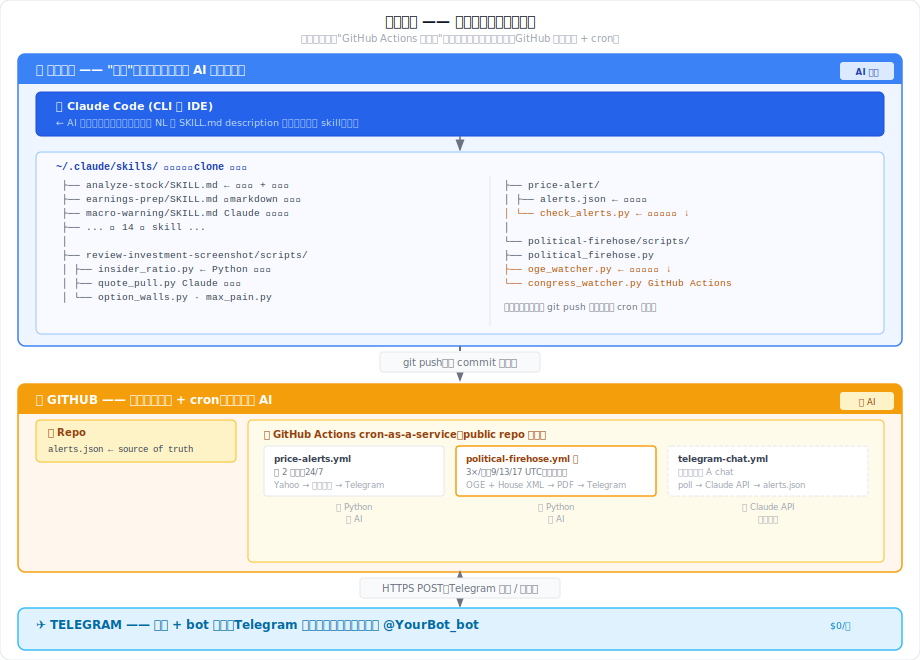

# Claude 投资分析 Skills 系统

> 给 [Claude Code](https://docs.claude.com/claude-code) 用的投资分析自动化系统。
> Top-Down 框架：宏观 → 年度主题 → 板块 → 个股 → 入场点位 → 仓位。
> 价值 + 期权 + 宏观感知三合一，支持中英文自然语言触发。

[English Version](./README.md) · [5 分钟介绍](./INTRODUCTION-zh.md) · [English intro](./INTRODUCTION.md)

## 🎯 适用人群（以及不适用的）

这是一个**研究级别的投资思考伙伴**，不是交易 bot。

### 设计给

- 🏦 **个人 / 个人理财投资者**（taxable 账户、IRA / 401k、家庭账户）
- 📚 **Buy-side 主观交易** —— 不是 market maker、不是算法 / HFT 公司
- 📉 **左侧布局**风格：弱势分批建仓、看估值
- 📈 **右侧反转**风格：恐慌后确认入场（ORCL 模式）
- 🕒 **Swing（1-3 周）/ Position（1-3 月）/ LEAPS（6-24 月）** 时间框架
- 🌐 **美股 + ETF + 期权**（FX / 加密货币 / 国际市场在路线图上 —— 见 [NEXT-STEPS-zh.md](./NEXT-STEPS-zh.md)）

### 不适合

- ⚡ **高频交易（HFT）** —— 本文定义：**同一资产类型每日交易 >5 次**。2 分钟 cron + 1-3 秒 webhook 的延迟对这类策略太粗
- 🤖 **算法 / 做市**策略：需要毫秒级延迟
- 💱 外汇 / 加密货币 / 非美股（目前 —— yfinance 覆盖不稳定；在路线图）
- 📊 **纯量化回测** —— 本框架是 live data + 主观决策；不做信号回测
- 🎯 **日内交易** —— 2 分钟粒度对 scalping 太粗；用真正的 broker alert
- 🏢 **B2B / 托管 SaaS** —— 没有 hosted tier。每个用户都在自己的 fork 上自托管。

### 延迟预期（实话实说，能做到啥不能做到啥）

| 层 | 延迟 | 适合 |
|---|---|---|
| 价格扫描（alert 触发）| 2 分钟 cron | 研究级触发（"GLW 回到 tier-1 时提醒"）|
| Chat 路径 A（GH Actions polling）| 2-15 分钟回复 | 跟 bot 偶尔聊聊 |
| Chat 路径 B（Cloudflare webhook）| 1-3 秒回复 | 跟 bot 主动对话 |
| End-to-end `macro-warning` 全扫描 | 30-60 秒 | 每日盘前 regime 读 |

**这些延迟对 HFT 来说都属于慢**。如果你要 sub-100ms 响应，这不是合适的工具。如果你每只票每日交易 < 5 次、关心基本面 thesis 是否对，就是合适的。

未来功能（EMA、RSI、成交量 alert、更多通知 channel、FX/加密货币、实时 WebSocket 选项）见 [`NEXT-STEPS-zh.md`](./NEXT-STEPS-zh.md)。

---

## 🤖 给 AI agent / CLI 用户

两个入口，看 agent 处于**哪个阶段**：

- **Setup 阶段**（用户刚粘了 repo URL 让你帮装/配）→ 读 [`AGENTS.md`](./AGENTS.md)（中文版 [`AGENTS-zh.md`](./AGENTS-zh.md)）。包含 PREP 问卷、flow 识别、一步步安装、gotchas（PAT 权限、webhook SSL 等）、交接规则。Claude Code / Codex / Cursor / 自定义 agent 通用 —— `CLAUDE.md` 是个 alias。
- **Runtime 阶段**（skill 已装好，用户在问投资问题）→ 读 [`AGENT-TOOL-REFERENCE.md`](./AGENT-TOOL-REFERENCE.md)。包含中英 NL 触发、精确 CLI 模板、参数说明、多工具组合 pattern。

也有用：[`INVESTMENT-WORKFLOW.md`](./INVESTMENT-WORKFLOW.md)（投资问题该选哪个 skill）、[`ARCHITECTURE.md`](./ARCHITECTURE.md)（为什么数据 plumbing 长这样 —— yfinance MCP + 直接 HTTP API + openinsider，而不是 3-MCP 全套）。

---

## ⚡ 一键开始 —— **二选一**

**前置依赖：** macOS 或 Linux、Python 3.9+、已装 [Claude Code](https://docs.claude.com/claude-code/install)。

### 选项 1 —— Plugin marketplace（推荐新用户，30 秒）

```bash
# 1. 在 Claude Code 里添加 marketplace
/plugin marketplace add ssurmic/claude-investment-skills

# 2. 装 plugin
/plugin install claude-investment-skills@claude-investment-skills-marketplace

# 3. 跑 setup（建 Python venv，装 yfinance）
bash ~/.claude/plugins/claude-investment-skills/setup.sh

# 4. 跟 Claude 用大白话说话（中英文都行）
分析一下 NVDA
```

### 选项 2 —— Git clone（想 fork + 自定义就选这个，3 分钟）

```bash
# 1. Clone 到 Claude Code 的 skills 目录
git clone https://github.com/ssurmic/claude-investment-skills.git ~/.claude/skills

# 2. 跑 setup（建 Python venv，装 yfinance，验证 14 个 skills）
bash ~/.claude/skills/setup.sh

# 3. 跟 Claude 用大白话说话
分析一下 NVDA
```

**Two-way door。** 两种装法**装出来一模一样** —— 同一份 14 个 skill、同一批 Python 脚本、同一套 Telegram alert pipeline。看你要不要 fork（选项 2）还是只用工具（选项 1）。之后想换也行 —— 卸了一个装另一个；`alerts.json` 反正在你的 GitHub fork 里。

**分析 skill 不用 slash 命令**，自然语言就触发，跟装法无关。（想用 slash 命令也行 —— `/analyze-stock NVDA` 一样 work。）

---

## 📦 组件分工 —— 谁在哪跑（先看这个）



### "移动平均线"这个数据从哪算？

这个最容易让人糊涂 —— **同样的数据**根据你问的目的，**在两个不同的地方算**：

| 你问 | 在哪算 | 为啥 |
|---|---|---|
| "NVDA 当前 50DMA 是多少？"（分析）| **你的电脑**，`analyze-stock` skill 调 `quote_pull.py` | Claude Code 是交互式的；你问的时候拉实时数据 |
| "NVDA 跌破 50DMA 提醒我"（alert）| **GitHub Actions runner**，跑 `check_alerts.py` cron | Cron 在你电脑关机时也得跑 —— 这是 alert 的全部意义 |
| "通过 Telegram bot 设这个 alert"（chat）| **GitHub Actions**（选项 A）或 **Cloudflare Worker**（选项 B）| 看你选哪条 chat 路径 —— 两者都调同一个 Yahoo API |

### 各种"智能"住在哪？

| 问题 | 谁决定 | Claude 在哪 |
|---|---|---|
| "analyze NVDA" 对应哪个 skill？ | 你电脑的 Claude Code | 本地 |
| 现在该不该加 NVDA？ | `analyze-stock` skill，本地的 Claude 跑 | 本地 |
| `alerts.json` 是合法 JSON 吗？ | GitHub Action 的 sanity check | GitHub（不要 AI） |
| NVDA 跨过 $213.89 了吗？ | `check_alerts.py` 纯 Python | GitHub cron（不要 AI） |
| 用户说"等英伟达跌破 213.89 通知我"是啥意思？ | Anthropic API tool-use 调用 | GitHub cron（选项 A）或 Cloudflare Worker（选项 B） |
| Alert 触发后该不该加？ | 你电脑的 Claude Code 跑 `analyze-stock` | 本地 |

**规律**：**所有真正的投资思考都发生在本地** Claude Code 里。GitHub / Cloudflare 只处理无聊的事（调度、bot 简短回复的 NL 解析、JSON 编辑）。你**永远不需要把决策权交给一个远端 AI** —— 决策级别的分析只在你坐在 Claude Code 前的时候跑。

---

## 🔥 三条 Discovery Firehose —— *在 Twitter 之前抓到下一只股票*

### 这是在解决什么问题

每次一只票 10x，剧本都一样:

> ❌ **第 0 天**: SEC filing 公开。推特上没人注意。
> ❌ **第 30 天**: 彭博发个短讯。
> ❌ **第 60 天**: 第一篇付费 Substack 发文。
> ❌ **第 120 天**: Reddit 开始讨论。
> ❌ **第 180-540 天**: Twitter KOL 发推。**K 线已经抛物线了，你买在顶部。**

信息一直是公开免费的。**瓶颈不是访问权限 —— 是速度。**

### 这个工具做什么

三条 SEC EDGAR firehose 在 GitHub Actions 上作为 cron 跑, **每 30 分钟一次**, 工作日早 9 点到晚 7:30 美东。它们扫**每一份 SEC 发布的 filing**, 提取真有 alpha 的, 用估值 + 价格行动 enrich, 0-10 打分, 推送 Telegram。

**你不需要告诉它看什么。它告诉你看什么。**


### 四个真实案例 —— 看清 alpha 是怎么"漏"出去的

这不是假设。这是真实的 filing + 真实的价格。

**三条 alpha 渠道**：SEC EDGAR (8-K / Form 4) · 13F 对冲基金 · 政治官员交易 (OGE 278-T + STOCK Act)

#### 案例 1: CoreWeave (CRWV) —— $40 到 $187 / 3 个月

AI 时代最戏剧性的 IPO 故事。8-K 披露 OpenAI 为战略股东这件事, 在 EDGAR 上**IPO 后 2 天**就有了。第一篇 Substack **5 周后**才发。等 Twitter 上图表抛物线时, **已经 +367%**。


| 来源 | 日期 | 价格 | 距 SEC 滞后 |
|---|---|---|---|
| **SEC 8-K Item 3.02 OpenAI $350M PIPE** | 2025-03-31 | **$40-48** | 0 天 |
| 彭博文章 | 2025-04-15 | $50 | +15 天 |
| 第一篇 Substack | 2025-05-08 | $54 | +38 天 |
| Reddit 炒作 | 2025-05-19 | $80 | +49 天 |
| Twitter 抛物线 ATH | 2025-06-16 | **$187** | +77 天, **+367%** |

#### 案例 2: Powell Industries (POWL) —— 匿名客户, 7 天 +73%

一家 50 年历史的工业公司, 卖配电柜的。无聊。然后一份 8-K 宣布"*公司史上最大订单, $400M+, 客户是某美国大型科技公司*"。客户**被刻意隐去** —— 这是 hyperscaler 大单的典型做法。

简单的 scanner 会错过, 因为文本里没有 "NVIDIA" / "Microsoft" / "Amazon"。**v2.4 路径 B (主题分类器) 靠关键词密度抓到**: "behind-the-meter" + "multi-gigawatt" + "data center" + "largest order in company history" 评分 10/10。


| 来源 | 日期 | 价格 | 距 SEC 滞后 |
|---|---|---|---|
| **SEC 8-K Item 1.01 + 8.01 (匿名客户)** | 2026-05-06 | **$186** | 0 天 |
| Crux Capital 推文 | 2026-05-08 | $202 | +2 天 (+8%) |
| Kaduna 推文 | 2026-05-12 | **$322** | +6 天, **+73%** |

#### 案例 3: Penguin Solutions (PENG, 原 SGH) —— 22 个月闷烧

最长的导火索。SK Telecom $200M PIPE 优先股在 8-K Item 3.02 上**躺了 22 个月**才被 Twitter 发现。有耐心的资金 +150%。


| 来源 | 日期 | 价格 | 距 SEC 滞后 |
|---|---|---|---|
| **SEC 8-K Item 3.02 SK Telecom $200M** | 2024-07-15 | **$20** | 0 天 |
| 公开改名 SGH → PENG | 2024-10 | $22 | +3 个月 |
| CES 2025 合作官宣 | 2025-01-09 | $22 | +6 个月 |
| Q2 战略转向 inference AI | 2026-04-01 | $18-30 | +20 个月 |
| 第一篇 Substack | 2026-05-08 | $44 | +21.5 个月 |
| Kaduna 推文 | 2026-05-12 | **$50** | +22 个月, **+150%** |

#### 案例 4: 政治官员交易监控 —— 白宫 + 国会, 强制披露窗口

法律要求所有联邦官员在交易后 **30-45 天内强制披露**。这个窗口里的信息在 Twitter/CNBC 发现前**几天到几周**就已经在 OGE/STOCK Act 系统里了。

> **Trump Q1 2026**: 一季度内 3,642 笔交易（MSFT $5M-25M 买入 · VANGUARD $5M-25M 卖出 · NVDA/ORCL/META 买入）。278-T 于 **5/8/2026 提交 OGE**，我们的 script **当天早上**抓到并推送 Telegram。CNBC 分析文章 **2 天后**才出。

> **John McGuire (众议员, R-VA)**: 5/13/2026 买入 AAPL + MSFT + NVDA，House PTR 同日提交，**当天早 9 点**推送 Telegram。


| 来源 | 日期 | 交易 | 距披露滞后 |
|---|---|---|---|
| **OGE 278-T 提交 (Trump Q1 2026)** | 2026-05-08 | MSFT $5M–$25M 买, VANGUARD $5M–$25M 卖, **ORCL $1M–$5M 买** (3/17), NVDA $1M–$5M 买 | **0 天** (script 当天抓到) |
| **House PTR 提交 (McGuire)** | 2026-05-13 | AAPL + MSFT + NVDA 买入 | **0 天** (早 9 点推送) |
| 媒体开始报道 278-T | 2026-05-10 | — | +2 天 |
| Twitter 热议"白宫加仓 MSFT" | 2026-05-14 | — | +6 天 |

**Telegram 推送格式（OGE 278-T — Trump Q1 2026，法定披露数据，非投资建议）**

```
🏛 OGE 278-T  ⚡ NEW FILING

👤 Donald J. Trump  🔴 R
🎯 President of the United States
🗓 Filed: 5/8/2026  |  2,707 total (2,415 buys / 292 sells)

🟢 TOP BUYS (2,415 total):
  🟢 MSFT   Microsoft Corp        $5M–$25M  3/17/2026
  🟢 NVDA   Nvidia Corp           $1M–$5M   2/10/2026
  🟢 ORCL   Oracle Corp           $1M–$5M   3/17/2026  ← Trump 季内最大科技买入之一
  🟢 HOOD   Robinhood Markets     $1M–$5M   2/10/2026
  🟢 QCOM   Qualcomm Inc          $1M–$5M   1/12/2026
  _...+2,410 more buys_

🔴 TOP SELLS (292 total):
  🔴 VIG    Vanguard Div ETF      $5M–$25M
  🔴 META   Meta Platforms        $5M–$25M
  _...+290 more sells_

📎 OGE 278-T PDF →  https://extapps2.oge.gov/...
_3,642 trades Q1 2026. ORCL/NVDA/HOOD 买; VIG/META 卖_
```

**Telegram 推送格式（STOCK Act PTR — 国会众议员）**

```
🏛 STOCK Act PTR  ⚡ NEW FILING

👤 Rep. John McGuire  🔴 R-VA
🎯 U.S. House of Representatives
🗓 Filed: 2026-05-13  |  3 笔交易

  🟢 AAPL   Apple Inc            $1K–$15K  2026-05-13
  🟢 MSFT   Microsoft Corp       $1K–$15K  2026-05-13
  🟢 NVDA   NVIDIA Corporation   $1K–$15K  2026-05-13

📎 PTR Filing →  House Disclosure Portal
```

**alpha 来自哪里 / Alpha 漏出路径**：

```
联邦法律强制披露 (STOCK Act + OGE 监管条例)
         │
         ├── 国会 535 人 ── STOCK Act PTR ── 45 天窗口
         │       │            (House XML + Senate eFD)
         │       └── 我们的 script → Telegram (当天)
         │
         └── 白宫 / 内阁 ── OGE Form 278-T ── 30-45 天窗口
                 │            (OGE PDF portal, pdfplumber 解析)
                 └── 我们的 script → Telegram (当天)
                              │
                              ▼
                    散户 / CNBC / Twitter
                    (2-14 天之后才发现)
```

**跟踪名单 (12 人)**：
- 🏛️ 行政: Trump (P1) · Bessent 财长 (P1) · Lutnick 商务部长 (P1)
- 🏛️ 参议院: Tuberville (P1) · Kelly · Sullivan · Whitehouse
- 🏛️ 众议院: Pelosi (P1) · Austin Scott (P1) · Crenshaw (P1) · McCaul · Gottheimer · MTG

---

### 三条 firehose 各干什么

| Firehose | 扫什么 | 发现什么 |
|---|---|---|
| **`insider-firehose`** | SEC Form 4 atom feed | 高管 / 董事公开市场买入 ≥ $200k (只看 code "P", 不含 RSU 归属) |
| **`strategic-partner-firehose`** | SEC 8-K + SC 13D atom feed | **路径 A**: 具名 Tier-1 战略投资人 (NVIDIA, MSFT, SK Telecom, Samsung, MGX, PIF, …)。**路径 B**: 主题分类器抓 POWL 类**匿名客户**大单 |
| **`composite.py`** (共享) | 上面两条 firehose 的 alert log | 同一 ticker 30 天内触发两条 → 🚨🚨🚨 **MEGA SIGNAL** (罕见, < 1% 的 alert) |

### 怎么用

```
   1. Fork 这个 repo (一次)
   2. 在 GitHub Secrets 设 TELEGRAM_BOT_TOKEN + TELEGRAM_CHAT_ID
   3. 启用 GitHub Actions workflows
   4. ─── 然后什么都不用做 ───
   5. SEC 一有动静, Telegram 就响
   6. (可选) 跟 Claude Code 聊推送过来的那些 ticker
```

**这是 cron 驱动, 不是 chat 驱动。** Firehose 自己不需要任何自然语言命令 —— 它们在后台静默运行。NL 只是用来**调查 + 决定**它们推送过来的东西:

```
"analyze TICKR"                  → 触发 analyze-stock
"TICKR $X 能买吗"                  → 触发 analyze-stock + macro-warning 闸门
"TICKR 期权墙"                     → 触发 option-wall-analysis
"找下一个 PENG"                    → 触发 find-untapped-thesis
"TICKR 跌到 $X 通知我"              → 触发 price-alert
```

### 这个工具**不是**什么

- ❌ 不是交易 bot —— 它不下单
- ❌ 不是回测引擎 —— 历史回放仅限基于 fixture 的单元测试
- ❌ 不是 tick 级流数据 —— SEC EDGAR 没 WebSocket; 我们每 30 分钟轮询 atom feed (已经比 Twitter 快 6-540 倍)
- ❌ 不是"秘密优势" —— Substack 作者也在读同一个 EDGAR。我们只是把轮询自动化, 你不需要付 $20/月订阅每个作者

### 成本

| 组件 | 成本 |
|---|---|
| SEC EDGAR (8-K, 13D, Form 4 feeds) | $0 (公开, 免费, 无需 API key) |
| yfinance 估值数据 (P/E, mcap, 52W) | $0 |
| GitHub Actions cron | $0 (公开 repo) |
| Telegram bot | $0 |
| **总计** | **$0 / 月** |

你唯一的"成本"是在 GitHub 上 fork 一下 + 5 分钟设 Telegram。

---

## 🔍 状态源 —— 每样东西住在哪 + 怎么查

每一份 state 都有**唯一权威来源**。知道去哪看，"bot 不工作了"这种谜题立刻变成 30 秒诊断。**任何状态都能用一条 `cat` / `curl` / `gh` / `wrangler` 命令读到** —— 没有黑箱。

### 你的配置状态（住在你的 GitHub fork 里）

| 状态 | repo 里的路径 | 怎么查 | 谁写它 |
|---|---|---|---|
| **活跃 alerts** | `price-alert/alerts.json` | `curl https://raw.githubusercontent.com/<你>/claude-investment-skills/main/price-alert/alerts.json` | 你（`git commit`）或 bot（通过 chat 路径）|
| **触发历史** | `price-alert/alerts_fired.log` | 同上换路径 | `check_alerts.py` cron —— 只追加 |
| **Bot poll 游标**（仅选项 A）| `price-alert/tg_state.json` | 同上换路径 | `chat_handler.py` cron —— 自动 commit 最近的 `update_id` |

### 你的 secrets（三个可能的家 —— 每条路径各自一份）

| Secret | 本地 `.env` | GitHub Secrets | CF Worker Secrets |
|---|---|---|---|
| `TELEGRAM_BOT_TOKEN` | 本地 CLI 测试用 | ✅ Flow B+ | ✅ Flow D |
| `TELEGRAM_CHAT_ID` | 本地 CLI 测试用 | ✅ Flow B+ | ✅ Flow D |
| `ANTHROPIC_API_KEY` | 可选 | ✅ Flow C | ✅ Flow D |
| `GITHUB_TOKEN`（Contents: R+W PAT）| 可选 | （workflow runner 内置 GITHUB_TOKEN，不用自己设）| ✅ Flow D |
| `GITHUB_REPO`（`<owner>/<repo>`）| 可选 | （内置）| ✅ Flow D |

**查哪里设了哪些**：

```bash
# 本地 .env（值可见 —— 本地就是这个用途）
cat ~/.claude/{skills,plugins/claude-investment-skills}/price-alert/.env 2>/dev/null

# GitHub Secrets（只有名字，值加密）
gh secret list --repo <你>/claude-investment-skills

# Cloudflare Worker Secrets（只有名字）
cd ~/.claude/{skills,plugins/claude-investment-skills}/price-alert/webhook 2>/dev/null && wrangler secret list
```

### 实时运维状态

| 你的问题 | 命令 | 看到啥 |
|---|---|---|
| Cron 最近跑过吗？ | `gh run list --workflow=price-alerts.yml --limit=5 --repo <你>/claude-investment-skills` | 最近 5 次扫描 + 状态 |
| 某次 run 为啥失败？ | `gh run view <run-id> --log` | 那次 run 完整 stdout |
| Webhook 注册 + 健康？ | `curl "https://api.telegram.org/bot$TOKEN/getWebhookInfo"` | URL + 排队数 + 最近错误 |
| Webhook **现在**在干啥？ | `cd .../webhook && wrangler tail` | 实时请求 + console.log |
| Bot 通吗？ | `curl "https://api.telegram.org/bot$TOKEN/getMe"` | Bot 用户名 + capabilities |
| Webhook 7 天请求历史 | Cloudflare dashboard → Workers → `price-alert-webhook` → Logs | 实时 + 保留 7 天 |

### 市场数据从哪来（外部源，每次现拉）

| 数据 | 来源 | URL pattern | 费用 |
|---|---|---|---|
| 实时价、MA、目标价、P/E、52w 区间 | Yahoo Finance | `query1.finance.yahoo.com/v8/finance/chart/<ticker>` | 免费、无 key |
| Form 4 内部交易（P / S / A / M / F / G codes）| openinsider.com | `openinsider.com/screener?s=<ticker>` | 免费、scrape HTML |
| 期权链、IV、OI | yfinance | 同 Yahoo | 免费 |
| 宏观指标（CPI、CAPE、yields、USDJPY）| FRED CSV | `fred.stlouisfed.org/graph/fredgraph.csv?id=<series>` | 免费、无 key |
| Fear & Greed Index | CNN 非官方 JSON | `production.dataviz.cnn.io/index/fearandgreed/graphdata` | 免费 |
| 股票新闻、电话会议、监管公告 | `WebSearch`（Claude Code 内置）| n/a | Pro/Max 订阅免费 |

### 你的安装代码住哪

| 组件 | 本地路径 |
|---|---|
| Skill markdown + Python 脚本 | `~/.claude/skills/`（git clone）或 `~/.claude/plugins/claude-investment-skills/`（plugin 装）|
| Python venv | `/tmp/.insider_venv/`（`setup.sh` 建，每次跑重建）|
| MCP server 注册 | `~/.claude.json`（由 `claude mcp add` 管理）|
| 你的对话 memory | `~/.claude/projects/<workspace>/memory/MEMORY.md` |
| Shell 历史 / 偏好 | （本工具集不存；你 shell 自己存哪就在哪）|

### 什么**不**存（按设计是 ephemeral 的）

- **你的组合持仓** —— 本工具集从不持久化。粘截图也只在那次对话里存在。
- **实时报价** —— 每次调 skill 现拉；从不缓存。
- **分析输出** —— 只在你对话历史里（Claude Code 自己的 state，不在本 repo 里）。
- **Insider 原始 HTML** —— 每次调 `insider_ratio.py` 都从 openinsider 现拉。

> **核心原则**：上面列出的每个 observable 都能用一条终端命令读到。如果你**读不到**，说明系统坏了（或者没装好）。下次想问"我的 bot 工作着吗"，跑上面任意一条命令，而不是瞎猜。

---

## 🏗️ 架构一览

`price-alert` skill（可选 Telegram + Anthropic API 集成）。chat 路径有**两种实现方式可互换** —— 按你想要的延迟挑一个：



> 🔧 源文件：[`diagrams/architecture-zh.mmd`](./diagrams/architecture-zh.mmd) —— 改 `.mmd` 文件然后 push，`.svg`/`.png` 会通过 [`render-diagrams.yml`](./.github/workflows/render-diagrams.yml) 自动重新生成。详见 [Diagrams pipeline](./README.md#-diagrams-pipeline-mermaid--svg)（README 英文版有完整说明）。

**两条 chat 路径，效果相同 —— 延迟不同**：

| | 选项 A: GitHub Actions polling | 选项 B: Cloudflare Worker webhook |
|---|---|---|
| **模型** | Pull（cron 主动去问"有新消息吗"）| Push（Telegram 即时把消息推过来）|
| **延迟** | 2-15 分钟 | 1-3 秒 |
| **冷启动** | Ubuntu VM ~10-30 秒 | V8 isolate ~50 毫秒 |
| **配置耗时** | 10 分钟（[SETUP-zh.md](./price-alert/SETUP-zh.md)）| 上面基础上 +5 分钟（[SETUP-WEBHOOK-zh.md](./price-alert/SETUP-WEBHOOK-zh.md)）|
| **费用** | $0 | $0（CF 免费层 10 万 req/天）|

先用选项 A。如果你**真的经常和 bot 聊**而且觉得 2-15 分钟延迟烦，再升级到 webhook。

**每月费用估算**：跳过可选的 Telegram chat bot = **$0**；中度 NL chat ~$1-4/月（Anthropic API，**两种路径一样的钱** —— Claude 调用本身一样）。完整成本细分见 [INTRODUCTION-zh.md](./INTRODUCTION-zh.md#-每月成本估算)。

每个组件的详细工作机制见 [INTRODUCTION-zh.md → 完整系统怎么工作](./INTRODUCTION-zh.md#-完整系统怎么工作--架构图进阶)。

---

## 🎨 架构图 pipeline（Mermaid → SVG）

本 README 和 [`INTRODUCTION-zh.md`](./INTRODUCTION-zh.md) 里的架构图**不是** GitHub 客户端渲染的 Mermaid，而是从 Mermaid 源文件生成的 `.svg` + `.png` 静态文件 —— README 加载更快，GitHub / 手机 / 本地 viewer 看起来都一致。

```
diagrams/
├── architecture-en.mmd       ← source of truth（改这个）
├── architecture-en.svg       ← committed artifact，README.md 用
├── architecture-en.png       ← committed artifact，不支持 SVG 的 viewer 用
├── architecture-zh.mmd       ← 中文 source of truth
├── architecture-zh.svg       ← README-zh.md 用
└── architecture-zh.png
```

### 本地工作流

```bash
# 1. 装 mermaid-cli（一次性）
npm install -g @mermaid-js/mermaid-cli

# 2. 改源文件
$EDITOR diagrams/architecture-zh.mmd

# 3. 重新生成旁边的 .svg + .png
bash scripts/render-diagrams.sh                              # 全部 render
bash scripts/render-diagrams.sh diagrams/architecture-zh.mmd # 只 render 一个

# 4. 把 .mmd 源 + 生成的图一起 commit
git add diagrams/architecture-zh.{mmd,svg,png}
git commit -m "docs: 调整架构图"
```

### CI 工作流（push 后自动 render）

[`.github/workflows/render-diagrams.yml`](./.github/workflows/render-diagrams.yml) 监听 `diagrams/**.mmd` 的变化 —— 你 push 改动后它自动重新生成 `.svg`/`.png`。这个 workflow 装 `mermaid-cli` + `fonts-noto-cjk`（确保中文渲染正常），跑 `scripts/render-diagrams.sh`，然后把图片改动 commit 回 `main`。

这意味着你**可以直接在 GitHub web editor 里改 `.mmd` 文件**，workflow 帮你 render。不想在本地装 mermaid-cli 的话完全可以不装。

### 为什么预渲染而不用 GitHub 自带的 Mermaid block？

| | GitHub 自带 `\`\`\`mermaid` block | 预渲染 SVG（本仓库做法） |
|---|---|---|
| 渲染质量 | 不稳定；手机上字体 fallback、裁剪 | 像素级一致 |
| 加载速度 | 等页面加载完再客户端渲染 | 即时（静态资源）|
| `git clone` 后本地查看（VS Code 等）| ✅ 一般可以 | ✅ 永远可以 |
| 嵌到别处（PPT、文档）| ❌ 只能 Mermaid 环境 | ✅ SVG/PNG 哪都能用 |
| 仓库里有独立源文件 | ❌ 内嵌在 `.md`，diff 难看 | ✅ 独立的 `.mmd` 文件 |

---

---

## 🗣️ 自然语言怎么触发 skill 的（"魔法"）

你**不用记命令**，直接说话就行。原理：

### 机制

1. **每个 skill 在 `SKILL.md` 的 frontmatter** 里有个 `description:` 字段，列了触发短语（中英文都有）。
2. **Claude Code 拿你的输入**去匹配所有 skill descriptions，挑最匹配的。
3. **匹配上的 skill 加载完整 instructions** 并跑（拉实时数据、跑分析、返回答案）。

### 示例：`macro-warning` 怎么被触发

它的 description 里写了：
```yaml
Triggers in English ("macro warning", "regime check", "is the market at peak",
"should I take profits", "is it time to buy") or Chinese ("宏观警报",
"市场是不是顶了", "该不该减仓", "regime 怎么样", "该入场吗")
```

所以下面**任意说法**都触发同一个 skill：

| 你说 | 发生什么 |
|---|---|
| "macro warning" | → 触发 `macro-warning` |
| "is the market at peak right now?" | → 触发 `macro-warning` |
| "should I take profits?" | → 触发 `macro-warning` |
| "宏观警报" | → 触发 `macro-warning` |
| "市场是不是要顶了" | → 触发 `macro-warning` |
| "regime 怎么样" | → 触发 `macro-warning` |

### 组合触发（一句话调用多个 skill）

你可以自然地组合：

```
你: "我想在财报前买 AMD，宏观安全吗？"
→ Claude 先触发 macro-risk-check（regime 读取）
→ 再触发 earnings-prep（AMD 财报决策）
→ 也许再触发 analyze-stock（如果 regime 绿，做完整深度）
```

### 为什么这个机制稳

- **措辞变化都行** —— 不需要精确字句
- **句中切换中英文** —— "analyze NVDA, 顺便看看 macro warning" 也行
- **歧义会被澄清** —— 输入可能匹配多个 skill 时 Claude 会反问
- **Slash 命令仍然能用** —— `/analyze-stock NVDA` 是显式 fallback

完整映射（每个触发短语 → skill）在 [`AGENT-TOOL-REFERENCE.md`](./AGENT-TOOL-REFERENCE.md)。

---

## 💬 真实对话示例

5 个完整对话，展示实际怎么用。每个回复都用**实时数据**。

### 例 1 — 个股深度分析（英文）

```
你: analyze NVDA

Claude: [拉实时价格、估值、内部交易、期权 IV、宏观环境]

NVDA — 当前 $1,142, Forward P/E 38.2 (vs 板块中位数 26)

宏观环境: 🟠 ORANGE regime (NDX P/E 38, VIX 17 — 见 macro-warning)
年度主题: AI capex 延续到 2026；电力约束风险
板块倾斜: SMH +138% YoY = mania 区域
内部交易 (90 天): 0 buys, 4 sells = $312M (10b5-1 计划，权重低)
催化剂: 5/20 财报 (implied move ±8%), GB300 ramp, 中国市场不确定性

建议: 当前持仓 HOLD, $1,142 不加
3 档入场计划 (新仓):
  - Tier 1 (35%): $1,020-1,060 (50DMA + 20% drawdown)
  - Tier 2 (35%): $920-960 (200DMA, 历史反弹区)
  - Tier 3 (30%): $820 (38% drawdown — 周期回调 max-pain)

LEAPS 替代: Jan 2027 $1100 call @ $215, 盈亏平衡 $1315 (现价 +15%),
50% IV 给 5x 杠杆。如果想限定风险，更优。
```

### 例 2 — 加仓前宏观检查（中文）

```
你: 宏观警报，能不能加仓？

Claude: [跑 macro_pull.py 拉 8 层指标]

🟠 ORANGE regime — Composite 11/16

触发的硬规则:
  ✦ Shiller CAPE 42.05 > 38 (extreme)
  ✦ VIX 17.19 < 18 (exit-signal threshold)

8 层得分:
  🔴 估值 (2/2)  CAPE 42.05, SPX trailing PE 31.83
  🔴 波动 (2/2)  VIX 17.19, MOVE 67.25
  🟡 情绪 (1/2)  CNN F&G 66.9 (一周前 71.2，正在降温)
  🔴 信用 (2/2)  HY OAS 279 bps (complacency)
  🟡 货币 (1/2)  USD/JPY 156.62 (差 BOJ 干预区 3.4)
  🟡 宽度 (1/2)  SPX top 50 中只 44% 在 200DMA 上
  🟢 CTA  (0/2)  无公开 API
  🔴 板块 (2/2)  SMH 一年涨 +142% = mania

判断: 不建议加仓。现金 30-35%，trim AI/Semi 抛物 (-15-20%)，
买便宜 hedge (VIX 17 = put 极便宜)。

升级到 🔴 RED 触发器:
  - VIX < 14
  - F&G > 85
  - USD/JPY > 160
  - 30Y > 5.10%
```

### 例 3 — 财报前决策（中英混说）

```
你: AMD 财报后天，I'm holding 350 shares at $280 cost

Claude: [拉 AMD 实时数据、期权链、过去 8 季度历史]

AMD 财报准备 — 5/12 盘后报

Implied move (ATM straddle): ±9.2% ($30 振幅)
过去 8 季度: 6 beat / 2 miss; 平均反应 +4.1%, 范围 -12% 到 +18%
已 price in: 17% YoY 营收增长, MI400 ramp Q3/Q4 commentary
你的仓位: $98K @ $280 成本, 当前 +14% (+$13.7K 浮盈)

4 个情景 (概率加权):
  📈 Beat + raise (40%): +12-18% → $314-$330
  📊 In-line (30%):     -2 到 +5% → $275-$295
  📉 Light guide (20%): -8 到 -12% → $247-$258
  💥 Miss + cut (10%):  -15 到 -20% → $225-$238

建议: 财报前 TRIM 30% (105 股), hold 245
  原因: STCG 区间 (持有 7 个月), implied move 定价偏贵 vs realized
        部分锁定 14% 利润；剩下保留上行，万一 miss 有缓冲。
  税务: 105 × ($295-$280) = $1,575 STCG → ~$580 联邦 + 州税
```

### 例 4 — 截图组合审计

```
你: [贴组合截图]
    审一下我的组合

Claude: [解析截图，算风险指标]

组合审计 — 12 仓位, $487K 总额

集中度风险:
  🔴 NVDA 28% (>10% 红线) — 单股风险
  🟠 SMH+NVDA+TSM = 51% AI semi (板块集中)

因子暴露:
  - 高 beta 仓位: 67% (>50% 警戒线)
  - LEAPS theta drag: $890/周 (可接受)
  - 全多无对冲 (宏观翻车时脆弱)

减仓清单 (按优先级):
  1. NVDA: 减到 20% 仓位。卖 21 股 ≈ $24K。
     原因: 集中度, 抛物 +60% YoY, 宏观 ORANGE
  2. SMH: 减到 12%。卖 6 股 ≈ $3.4K。
     原因: 指数 ETF 与 NVDA 仓位重复
  3. PLTR: 全部清仓 ($18K)。
     原因: 内部交易检查显示 12 个月 0 买 41 卖

减仓后现金目标: 28% (当前 8%)
建议对冲: 1% QQQ Aug 680P @ $14 = $1,400 保护
```

### 例 5 — 主题筛选

```
你: 找未爆发的 AI 电力股

Claude: [筛公用事业 + 电力相关 + AI 数据中心曝险的标的]

Top 3 未爆发 AI Power 候选:

1. CEG (Constellation Energy) — $267
   Forward P/E: 24 (vs VST 31, NRG 28)
   1Y 涨幅: +18% (vs 板块 +35%)
   催化剂: 微软 20 年核电 PPA (2024/9 已签); 三里岛 1 号机组 2028
          重启
   内部交易: 90 天 2 buys, 0 sells = STRONG BUY 信号
   入场: 3 档 — $250 / $230 / $210

2. NRG (NRG Energy) — $94
   ...

3. PWR (Quanta Services) — $312
   电网建设的"卖铲人"，不是直接 AI 曝险但
   ...

每个候选包含: 3 档入场、仓位上限、催化日期、LEAPS 替代、下行情景。
```

---

## 🎯 这是什么

10 个专业 skills 组成的投资分析系统，给你**基金经理级别**的分析：

| Skill | 用途 | 触发关键词 |
|-------|------|----------|
| `analyze-stock` | 10 步深度分析任何股票 | "analyze X"、"X 是不是 buy"、"深度分析" |
| `macro-risk-check` | 每日宏观新闻扫描 | "宏观看一下"、"市场状态" |
| **`macro-warning`** | **每日 batch 8-层顶部预警**（NDX P/E / VIX / F&G / 信用 / 宽度 / 板块）| **"宏观警报"、"市场是不是顶了"、"该不该减仓"** |
| `find-untapped-thesis` | NOK 类未爆发筛选 | "找下一个 NOK"、"X 板块未爆发" |
| `earnings-prep` | 财报前决策框架 | "X 财报怎么处理"、"该持有还是减仓" |
| `leaps-screen` | LEAPS 长期期权选择 | "X 买什么 LEAPS"、"现货还是 LEAPS" |
| `option-wall-analysis` | 最大痛点 + 期权墙 | "X 的 max pain"、"option walls" |
| `tax-optimize` | LTCG vs STCG 决策 | "X 减仓税务"、"什么时候卖" |
| `portfolio-audit` | 完整组合风险审计 | "审一下我的组合"、"减什么仓" |
| `narrative-reversal-screen` | ORCL 风格反转筛选 | "找 ORCL 那种"、"暴跌反转" |
| `sector-rotation-analysis` | 板块热力图 + 轮动 | "板块轮动"、"该买哪个板块" |
| **`price-alert`** | **GitHub Actions + Telegram 价格 alert**（任何标的、任何阈值/百分比）| **"alert me when X hits Y"、"X 跌到 Y 通知我"** —— 见 [setup 指南](./price-alert/SETUP-zh.md) |

加上已有的：
- `review-investment-screenshot` — 截图组合速读
- `find-alpha` — 时间分级 alpha
- `schedule` — 远程定时 agent

---

## 📦 安装步骤

### 前置依赖

| 依赖 | 版本 | 安装 |
|------|------|------|
| **Claude Code** | 最新版 | https://docs.claude.com/claude-code/install |
| **Python** | 3.9+ | `brew install python3` (macOS) |
| **Git** | 任何版本 | `brew install git` |

### 必需的 MCP Servers

#### 1. yfmcp（YFinance MCP）— 必装
提供股票实时数据、期权链、新闻。

```bash
# 通过 Claude Code 安装
claude mcp add yfmcp -- npx -y @modelcontextprotocol/yfmcp

# 或者查最新安装命令：
# https://github.com/...yfmcp
```

#### 2. WebSearch — 内置
Claude Code 已包含。用于宏观事件、新闻、合同验证。

### 可选 MCP Servers（claude.ai connectors）

| Server | 用途 | 怎么装 |
|--------|------|------|
| Notion | 把分析存到笔记 | https://claude.ai/customize/connectors |
| Gmail | 读财报会议纪要 | 同上 |
| Google Calendar | 自动设置财报提醒 | 同上 |
| Google Drive | 引用投资文档 | 同上 |

### 完整安装步骤

```bash
# 1. 装 Claude Code（如果还没装）
# 看 https://docs.claude.com/claude-code/install

# 2. 装 yfmcp MCP server
claude mcp add yfmcp -- npx -y @modelcontextprotocol/yfmcp

# 3. Clone 这个 repo
cd ~/.claude/skills
git clone https://github.com/YOUR_USERNAME/claude-investment-skills.git .

# 4. 跑 setup
bash setup.sh

# 5. 验证
ls ~/.claude/skills/
# 应该看到: analyze-stock, macro-risk-check 等等

# 6. 测试
# 打开 Claude Code，输入：
/analyze-stock NVDA
```

---

## 🛠 目录结构

```
~/.claude/skills/
├── setup.sh                            # 一键安装脚本
├── INVESTMENT-WORKFLOW.md              # 主决策树
├── README.md                           # 英文文档
├── README-zh.md                        # 这个文件（中文）
│
├── analyze-stock/SKILL.md              # 10 步主框架
├── macro-risk-check/SKILL.md           # 每日宏观雷达
├── find-untapped-thesis/SKILL.md       # NOK 风格筛选
├── earnings-prep/SKILL.md              # 财报前分析
├── leaps-screen/SKILL.md               # LEAPS 选择
├── option-wall-analysis/SKILL.md       # Max pain + 期权墙
├── tax-optimize/SKILL.md               # LTCG/STCG 计算
├── portfolio-audit/SKILL.md            # 组合风险审计
├── narrative-reversal-screen/SKILL.md  # ORCL 风格反转
├── sector-rotation-analysis/SKILL.md   # 板块热力图
│
└── review-investment-screenshot/       # （已有）
    └── scripts/
        ├── insider_ratio.py            # v3：openinsider 主源，Form 4 code 感知，按时间分桶
        ├── cluster_buy_scan.py         # 新：扫描 openinsider /latest-cluster-buys 找 cluster 信号
        ├── quote_pull.py               # 批量实时报价
        ├── option_walls.py             # OI 集中 strikes
        └── max_pain.py                 # Max pain 计算
```

---

## 🎓 核心理念

Top-Down 宏观感知投资框架，5 大核心原则：

1. **AI = 工厂模式**，不是软件收税。Hyperscalers 像工厂买机器一样买算力。
2. **K 型分化**：板块内部赢家碾压输家。挑赢家。
3. **瓶颈环节升值**：被约束的供给环节（电力、燃料、材料）会重估。
4. **需求毁灭风险窗口**：定期监控油价、通胀、地缘政治信号。
5. **Carry trade 结构**：BOJ 政策能触发全球风险偏好级联反应。

加上纪律性原则：
- 永远查 insider trading（用 `insider_ratio.py`，不要相信 yfinance summary）
- 加仓前先看宏观（regime > 个股）
- 三档入场计划（不要"市价买入"）
- 仓位上限（单股 max 10%，高 beta max 5%）
- 现金就是 alpha（危险区 40-50%）

---

## 📝 触发示例（English + 中文）

每个 skill 都可以**用大白话**触发——不需要打 slash 命令。说什么都行，中英文随便切。

### 🆕 macro-warning（每日顶部预警）

**英文：**
- "Run macro warning"
- "Is the market at peak?"
- "Should I take profits?"
- "Regime check"

**中文：**
- "宏观警报"
- "市场是不是顶了"
- "现在该不该减仓"
- "regime 怎么样"
- "今天能不能加仓"

**设为定时任务：**
- "每天早上 8 点跑 macro-warning"
- "Set up daily macro-warning at 8am ET pre-market"

---

### 📊 analyze-stock（10 步深度分析）

**英文：** "Analyze NVDA"、"Is TSEM a buy?"、"Deep dive on FN"
**中文：** "分析一下 NVDA"、"TSEM 怎么样"、"FN 能买吗"、"深度看一下 GFS"

---

### 🔍 find-untapped-thesis（NOK 风格筛选）

**英文：** "Find me the next NOK"、"What's undervalued in AI Power"
**中文：** "找未爆发的 AI 电力股"、"光通信板块还有什么便宜的"、"找下一个 NOK"

---

### 🎯 find-alpha（3 时间维度 alpha）

**英文：** "Find alpha"、"Weekly alpha scan"、"What's the next MRVL setup?"
**中文：** "找 alpha"、"本周 alpha 扫一下"、"找下一个 MRVL"

---

### 📈 macro-risk-check（新闻型宏观）

**英文：** "Macro check"、"Is the market safe?"
**中文：** "看一下宏观"、"市场风险怎么样"、"现在能加仓吗"

---

### 💰 earnings-prep（财报前决策）

**英文：** "Earnings prep for AMD"、"Should I hold NVDA through earnings?"
**中文：** "AMD 财报前怎么看"、"NVDA 财报应该减仓吗"、"X 财报前分析"

---

### 📞 leaps-screen（长期期权）

**英文：** "LEAPS for NVDA"、"What call should I buy on TSEM?"
**中文：** "NVDA 买什么 LEAPS"、"TSEM 的长期 call"、"VST 现货还是期权"

---

### 🧱 option-wall-analysis（最大痛点+期权墙）

**英文：** "Max pain on NVDA"、"Option walls for AAPL"
**中文：** "NVDA 的 max pain"、"AAPL 期权墙"、"SPY 这周走哪里"

---

### 💼 portfolio-audit（组合风险审计）

**英文：** "Review my portfolio"、"Audit my book"、"Am I too concentrated?"
**中文：** "审一下我的组合"、"我组合风险大吗"、"该减什么仓"

---

### 🧾 tax-optimize（税务优化）

**英文：** "Should I sell NOK for tax?"、"LTCG vs STCG on NVDA"
**中文：** "X 减仓税务"、"现在卖还是等长期"、"X 减仓最省税"

---

### 🔄 sector-rotation-analysis（板块轮动）

**英文：** "Sector rotation"、"What sector to add?"
**中文：** "板块轮动"、"该买哪个板块"、"我是不是 tech 太重"

---

### 🪞 narrative-reversal-screen（暴跌反转）

**英文：** "Find beaten-down stocks with thesis"、"Comeback candidates"
**中文：** "找暴跌反转股"、"ORCL 那种反转"、"已经跌透的好股"

---

### 📸 review-investment-screenshot（截图速读）

直接发组合截图 + "看一下我的组合" 或 "what do you think?"

---

### 🔧 内部人脚本（高级功能）

**全市场 cluster buy 扫描：**
- "Find cluster buys" / "找 cluster buy" / "最近高管买入"

**单股内部人查询：**
- "Insider check on NVDA" / "TSEM 内部交易" / "X 高管在卖吗"

---

## 🚀 常用工作流

### 工作流 1：「该不该买 NVDA？」
```
1. /macro-risk-check          # 当前 regime 安全吗？
2. /analyze-stock NVDA        # 10 步深度分析
3. /option-wall-analysis NVDA # 短期价位
4. /leaps-screen NVDA         # 看看 LEAPS（如果入场点合适）
```

### 工作流 2：「该不该减仓？」
```
1. /macro-risk-check          # 看 regime
2. /portfolio-audit           # 完整审计（提供持仓）
3. /tax-optimize NOK 1000     # 每个减仓项查税
```

### 工作流 3：「AMD 明天财报怎么办？」
```
1. /earnings-prep AMD         # Implied move + 4 种情景
2. /option-wall-analysis AMD  # 锚定到哪儿
3. /tax-optimize AMD 350      # 如果减仓查税
```

### 工作流 4：「找好想法」
```
1. /macro-risk-check          # 避免坏时机
2. /find-untapped-thesis "AI Power"  # 筛选
3. /narrative-reversal-screen        # 反转标的
4. /analyze-stock [TOP_PICK]         # 深度分析头部赢家
```

---

## 📅 推荐定时任务

通过 `/schedule` skill 设置（直接说"每天早上 8 点跑 macro-warning"或 "set up daily macro warning at 8am ET"）：

| 频率 | Skill | 何时 | Cron (UTC) |
|------|-------|------|------------|
| **每个交易日早 8 点 ET** | **`macro-warning`** | **盘前 8-层顶部预警** | **`0 12 * * 1-5`** |
| 每个交易日下午 5 点 ET（可选） | `macro-warning` | 收盘后总结 | `0 21 * * 1-5` |
| 每周一早 8 点 ET | `macro-risk-check` | 新闻型 regime 读取 | `0 12 * * 1` |
| 每周五下午 4 点 ET | `find-untapped-thesis` | 找下周想法 | `0 20 * * 5` |
| 每月 1 日 | `portfolio-audit` | 完整组合审计 | `0 12 1 * *` |
| 重大事件前 24h | `macro-risk-check` | Fed/BOJ/重大财报前 | 手动 |
| 季度 | `tax-optimize` | 年末规划 | 手动 |

---

## 🔧 后台脚本

| 脚本 | 用途 | 用法 |
|------|------|------|
| `insider_ratio.py` (v3) | 严格开放市场 insider $ 比，openinsider 主源，按 Form 4 code 过滤（只算 P）| `python insider_ratio.py NVDA --window 90` |
| `cluster_buy_scan.py` | 扫描 openinsider 找市场全局 cluster buy | `python cluster_buy_scan.py --days 30 --min-value 500000 --min-insiders 3 --detail --enrich --senior-only` |
| `max_pain.py` | 按到期日的 max pain | `python max_pain.py NVDA 4` |
| `option_walls.py` | OI 集中 strikes | `python option_walls.py NVDA 4` |
| `quote_pull.py` | 批量实时报价 | `python quote_pull.py "A,B,C"` |

所有脚本使用 `/tmp/.insider_venv`（由 `setup.sh` 创建）。

### Insider 数据源（按可信度排序）
1. **openinsider.com/screener?s=TICKER** — 主源。Form 4 with codes（P=买入, S=卖出, A=授予, M=行权, F=税务, G=赠予）。免费，无需登录。
2. **secform4.com** — 备份。看 10b5-1 计划脚注。
3. **stocktitan.net SEC filings** — 可读 Form 4 描述。
4. **yfinance** — fallback。已知盲区（漏掉 NKE/UNH/PLTR 真实 cluster buy）。

---

## ⚠️ 硬性规则（不能违反）

1. **永远跑 `insider_ratio.py --window 90`**（openinsider 主源）— 不要信 yfinance 的「净买入」（把 RSU 算成买入）
2. **Form 4 code 只有 "P" 算买入** — A/M/F/G 是 RSU/行权/税务/赠予，**不是**买入信号。已验证假阳性：UNH "10 directors 4/1/2026"（全是 DSU 季度补偿）、PLTR "Karp 1.47M 股"（RSU 归属）
3. **任何 "cluster buy" 标题都要在 openinsider.com/[TICKER] 验证** — 媒体经常把补偿当成 conviction
4. **卖出要查 10b5-1**（在 secform4.com 看脚注）— 计划性 trust 卖出告诉你的不是当前观点
5. **加仓前先看宏观** — 再好的股在 red regime 里也跌
6. **仓位上限**：单股 max 10%，高 beta max 5%
7. **三档入场**：永远不要「市价买入」，必须有 50DMA / 200DMA 备份
8. **Concrete 证据 > 故事**：「AI 好」≠ 投资逻辑
9. **引用源**：每个宏观说法要带 WebSearch 链接
10. **税务感知出场**：特别是高收入者

---

## 🐛 故障排查

### 「yfmcp not found」
```bash
claude mcp list  # 看看装了哪些
claude mcp add yfmcp -- npx -y @modelcontextprotocol/yfmcp
```

### 「Python venv 不工作」
```bash
rm -rf /tmp/.insider_venv
bash ~/.claude/skills/setup.sh
```

### 「yfinance: ModuleNotFoundError」
```bash
/tmp/.insider_venv/bin/pip install --upgrade yfinance pandas numpy
```

### 「Skills 在 Claude Code 里不显示」
- 重启 Claude Code
- 确认 SKILL.md 的 frontmatter 有 `name:` 和 `description:`
- 检查权限：`chmod -R 755 ~/.claude/skills/`

---

## 📚 进一步学习

- **主决策树**：[INVESTMENT-WORKFLOW.md](./INVESTMENT-WORKFLOW.md)
- **每个 skill 细节**：`[skill-name]/SKILL.md`
- **宏观年度框架**：见 `analyze-stock/SKILL.md` 年度主题部分
- **Insider 方法论**：见 `review-investment-screenshot/SKILL.md`（已有）

---

## 🤝 给朋友分享

```bash
# 朋友只需要跑：
git clone https://github.com/YOUR_USERNAME/claude-investment-skills.git ~/.claude/skills
bash ~/.claude/skills/setup.sh

# 完事。他们就有了你完整的投资思维系统。
```

---

## ⚖️ 免责声明

这些 skills 是**个人投资研究的工具**。**不是金融建议**。历史业绩不代表未来。实际投资决策请咨询持牌金融顾问。

这个框架有特定风格（top-down、价值导向、宏观感知、期权友好）。**不适合**：
- 日内交易
- 纯量化策略
- 纯加密组合
- 外汇交易

---

## 📜 致谢

- **框架灵感**：Buffett（安全边际）+ Druckenmiller（宏观转折）+ Stan Weinstein（趋势阶段）
- **构建工具**：Anthropic 的 Claude Code

---

**版本**：1.0
**最后更新**：2026-05-04
