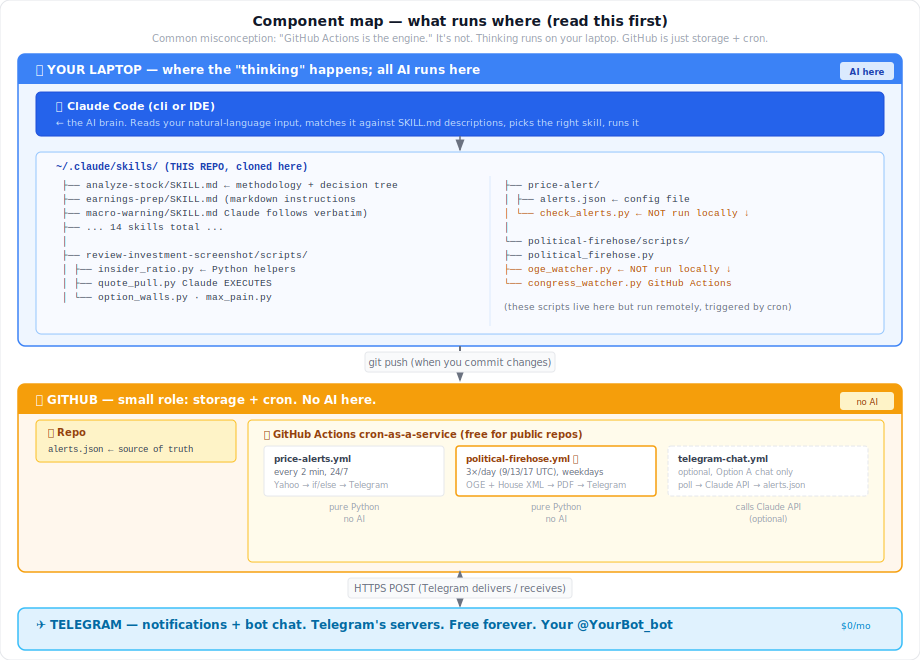
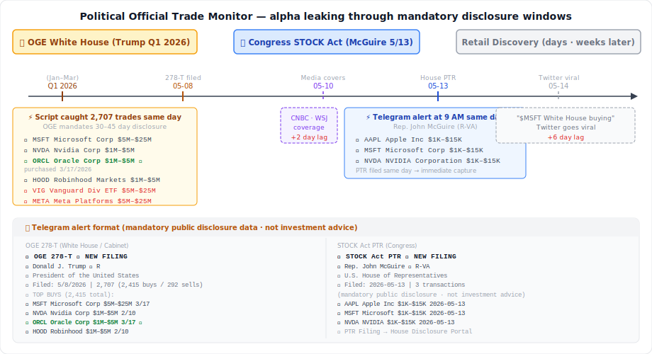

# Claude Investment Skills

> A streamlined investment analysis system for [Claude Code](https://docs.claude.com/claude-code).
> Top-down framework: Macro → Year theme → Sector → Stock → Entry → Sizing.
> Disciplined, valuation-aware, options-friendly. Triggers via natural language in English or Chinese.

[中文版本 / Chinese Version](./README-zh.md) · [5-min Introduction](./INTRODUCTION.md) · [中文介绍](./INTRODUCTION-zh.md)

## 🎯 Who this is for (and who it's NOT for)

This is a **research-grade investment thinking partner**, not a trading bot.

### Designed for

- 🏦 **Individual / personal-finance investors** (taxable account, IRA / 401k, family money)
- 📚 **Buy-side discretionary traders** — not market-makers, not algo / HFT firms
- 📉 **Left-side accumulation** style: buying weakness with tier-laddered entries, valuation-aware
- 📈 **Right-side reversal** style: capitulation-then-confirmation entries (the ORCL pattern)
- 🕒 **Swing (1-3 weeks) / Position (1-3 months) / LEAPS (6-24 months)** horizons
- 🌐 **US-listed equities + ETFs + options** (FX / crypto / international on roadmap — see [NEXT-STEPS.md](./NEXT-STEPS.md))

### NOT for

- ⚡ **High-frequency trading** — defined here as **>5 trades/day in any single asset type**. The 2-min cron + 1-3 sec webhook latencies are too coarse.
- 🤖 **Algorithmic / market-making** strategies that need millisecond execution
- 💱 FX / crypto / non-US listings (currently — yfinance coverage too inconsistent; on roadmap)
- 📊 **Pure quantitative backtesting** — the framework is live-data + discretionary, not signal-backtested
- 🎯 **Day-trading** — 2-min granularity is too coarse for scalping; use a real broker alert
- 🏢 **B2B / managed SaaS** — there is no hosted tier. Everyone self-hosts on their own fork.

### Latency expectations (be honest about what this can and can't do)

| Layer | Latency | Suitable for |
|---|---|---|
| Price scanner (alerts fire) | 2-min cron | Research triggers ("alert when GLW comes back to tier-1") |
| Chat path A (GH Actions polling) | 2-15 min response | Casual NL chat with bot |
| Chat path B (Cloudflare webhook) | 1-3 sec response | Active conversation with bot |
| End-to-end `macro-warning` full scan | 30-60 sec | Daily pre-market regime read |

**None of these are low-latency by HFT standards.** If you need sub-100ms, this is the wrong tool. If you trade < 5x/day per ticker and care about getting your fundamental thesis right, you're in the right place.

For planned features (EMA, RSI, volume alerts, additional notification channels, FX/crypto, real-time WebSocket option), see [`NEXT-STEPS.md`](./NEXT-STEPS.md).

---

## 🤖 For AI agents / CLI users

Two entry points, depending on **what phase** the agent is in:

- **Setup phase** (user just pasted this URL and wants you to install/configure things) → read [`AGENTS.md`](./AGENTS.md). It contains PREP questionnaire, flow detection, step-by-step install, gotchas (PAT scope, webhook SSL, etc.), and handoff rules. Works for Claude Code, Codex, Cursor, custom agents — `CLAUDE.md` is a thin alias.
- **Runtime phase** (skills are installed, user is asking investment questions) → read [`AGENT-TOOL-REFERENCE.md`](./AGENT-TOOL-REFERENCE.md). It contains NL triggers in EN + CN, exact CLI templates, parameter specs, and multi-tool composite patterns.

Also useful: [`INVESTMENT-WORKFLOW.md`](./INVESTMENT-WORKFLOW.md) (which skill to pick for an investment question) and [`ARCHITECTURE.md`](./ARCHITECTURE.md) (why the data plumbing looks the way it does — yfinance MCP + direct HTTP APIs + openinsider, not a 3-MCP stack).

---

## ⚡ Quick Start — pick ONE install method

**Prerequisites:** macOS or Linux, Python 3.9+, [Claude Code](https://docs.claude.com/claude-code/install) installed.

### Option 1 — Plugin marketplace (recommended for new users, 30 seconds)

```bash
# 1. Add the marketplace to Claude Code
/plugin marketplace add ssurmic/claude-investment-skills

# 2. Install the plugin
/plugin install claude-investment-skills@claude-investment-skills-marketplace

# 3. Run setup (creates Python venv, installs yfinance)
bash ~/.claude/plugins/claude-investment-skills/setup.sh

# 4. Talk to Claude in plain English (or Chinese)
analyze NVDA          # natural language works
```

### Option 2 — Git clone (recommended if you want to fork + customize, 3 minutes)

```bash
# 1. Clone to where Claude Code looks for skills
git clone https://github.com/ssurmic/claude-investment-skills.git ~/.claude/skills

# 2. Run setup (creates Python venv, installs yfinance, verifies all 14 skills)
bash ~/.claude/skills/setup.sh

# 3. Talk to Claude in plain English (or Chinese)
analyze NVDA
```

**Two-way door.** Both methods install the exact same 14 skills, the same Python scripts, the same Telegram alert pipeline. Pick based on whether you want to fork the repo (Option 2) or just use the tool (Option 1). You can switch later — uninstall one, install the other; `alerts.json` lives in your GitHub fork either way.

**No slash commands needed for analysis skills.** They trigger from natural language regardless of install method. (Slash commands are still available if you prefer — `/analyze-stock NVDA` works too.)

---

## 📦 Component map — what runs where (read this first)



### Where does each kind of "moving average" come from?

This trips people up because the SAME data is computed in TWO different places depending on what you're asking for:

| You ask | Where it computes | Why |
|---|---|---|
| "What's NVDA's 50DMA right now?" (analysis) | **Your laptop**, via `quote_pull.py` called by `analyze-stock` skill | Claude Code is interactive; pulls live data when you ask |
| "Alert me when NVDA crosses 50DMA" (alert) | **GitHub Actions runner**, via `check_alerts.py` cron | Cron runs even when your laptop is off; that's the whole point of alerts |
| "Set the alert via Telegram bot" (chat) | **GitHub Actions** (Option A) or **Cloudflare Worker** (Option B) | Whichever chat path you picked — both call the same Yahoo API |

### Where does each kind of intelligence live?

| Question | Who decides | Where Claude lives |
|---|---|---|
| Which skill matches "analyze NVDA"? | Claude Code on your laptop | Local |
| Should we add NVDA at this price? | `analyze-stock` skill, runs locally with your Claude | Local |
| Is `alerts.json` valid JSON? | GitHub Action sanity check | GitHub (no AI needed) |
| Did NVDA cross $213.89? | `check_alerts.py` Python | GitHub cron (no AI) |
| What did the user mean by "等英伟达跌破 213.89 通知我"? | Anthropic API tool-use call | GitHub cron (Option A) OR Cloudflare Worker (Option B) |
| Should I add NVDA after the alert fires? | Your laptop's Claude Code with `analyze-stock` | Local |

**The pattern**: **all real investment thinking happens locally** in Claude Code. GitHub / Cloudflare only handle the boring stuff (scheduling, NL parsing for short bot replies, JSON edits). You never have to trust a remote AI with your decisions — the decision-grade analysis only runs when YOU are sitting in front of Claude Code.

---

## 🔥 Four discovery channels — *catch the next ticker before Twitter does*

### The problem this solves

Every time a stock 10x's, the same pattern repeats:

> ❌ **Day 0**: SEC filing makes the news public. Nobody on Twitter sees it.
> ❌ **Day 30**: Bloomberg covers it briefly.
> ❌ **Day 60**: First Substack writer publishes a paid "deep dive."
> ❌ **Day 120**: Reddit catches wind.
> ❌ **Day 180-540**: A KOL on Twitter pumps it. **The chart is parabolic. You buy the top.**

The information was free and public the whole time. **The bottleneck wasn't access — it was speed.**

### What this skill does

Three SEC EDGAR firehoses run as GitHub Actions cron jobs **every 30 minutes** weekdays 9 AM - 7:30 PM ET. They scan **every filing the SEC publishes**, extract the alpha-rich ones, enrich with valuation + price action, score 0-10, and push to Telegram.

**You don't tell them what to watch. They tell you what to watch.**


### Three case studies — the actual alpha-leak timelines

These are not hypothetical. These are real filings with real prices.

#### Case 1: CoreWeave (CRWV) — $40 to $187 in 3 months

The single most dramatic AI-era IPO story. The 8-K naming OpenAI as a strategic equity investor was on EDGAR **2 days after IPO**. The first Substack writeup came **5 weeks later**. By the time the chart went parabolic on Twitter, the stock was already **+367%**.


| Source | Date | Price | Lag from SEC |
|---|---|---|---|
| **SEC 8-K Item 3.02 OpenAI $350M PIPE** | 2025-03-31 | **$40-48** | 0 days |
| Bloomberg article | 2025-04-15 | $50 | +15 days |
| First Substack writeup | 2025-05-08 | $54 | +38 days |
| Reddit pump | 2025-05-19 | $80 | +49 days |
| Twitter parabolic ATH | 2025-06-16 | **$187** | +77 days, **+367%** |

#### Case 2: Powell Industries (POWL) — anonymous customer, +73% in 7 days

A 50-year-old industrial company. Boring. Then a single 8-K announced "*the largest order in company history, $400M+ for a major U.S. technology company*." The customer was **redacted** — typical for hyperscaler deals.

A naive scanner would miss this because "NVIDIA" / "Microsoft" / "Amazon" aren't in the text. **v2.4 Path B (Theme Classifier) catches it via keyword density**: "behind-the-meter" + "multi-gigawatt" + "data center" + "largest order in company history" scores 10/10.


| Source | Date | Price | Lag from SEC |
|---|---|---|---|
| **SEC 8-K Item 1.01 + 8.01 (anonymous customer)** | 2026-05-06 | **$186** | 0 days |
| Crux Capital tweet | 2026-05-08 | $202 | +2 days (+8%) |
| Kaduna pump tweet | 2026-05-12 | **$322** | +6 days, **+73%** |

#### Case 3: Penguin Solutions (PENG, formerly SGH) — 22 months of dormant alpha

The longest fuse. SK Telecom's $200M PIPE Preferred filing on 8-K Item 3.02 sat in EDGAR for **22 months** before Twitter discovered it. Patient capital ran +150%.


| Source | Date | Price | Lag from SEC |
|---|---|---|---|
| **SEC 8-K Item 3.02 SK Telecom $200M** | 2024-07-15 | **$20** | 0 days |
| Public rebrand SGH → PENG | 2024-10 | $22 | +3 months |
| CES 2025 collaboration press | 2025-01-09 | $22 | +6 months |
| Q2 inference-AI pivot | 2026-04-01 | $18-30 | +20 months |
| First Substack writeup | 2026-05-08 | $44 | +21.5 months |
| Kaduna pump tweet | 2026-05-12 | **$50** | +22 months, **+150%** |

---

#### Case 4: Political official trade monitor — White House + Congress, mandatory disclosure windows

Federal law requires all government officials to disclose trades within **30-45 days**. That window sits **days to weeks ahead** of Twitter/CNBC coverage.

> **Trump Q1 2026**: 3,642 trades in a single quarter (MSFT $5M–$25M buy · VANGUARD $5M–$25M sell · NVDA/ORCL/META buys). The 278-T was filed with OGE on **5/8/2026** — our script caught it **same day**. CNBC analysis came **2 days later**.

> **Rep. John McGuire (R-VA)**: Bought AAPL + MSFT + NVDA on 5/13/2026. House PTR filed same day — **Telegram alert by 9 AM**.



| Source | Date | Trades | Lag from disclosure |
|---|---|---|---|
| **OGE 278-T filed (Trump Q1 2026)** | 2026-05-08 | MSFT $5M–$25M buy, VIG $5M–$25M sell, **ORCL $1M–$5M buy** (3/17), NVDA $1M–$5M buy | **0 days** (script same day) |
| **House PTR filed (McGuire)** | 2026-05-13 | AAPL + MSFT + NVDA buys | **0 days** (9 AM alert) |
| Media begins covering 278-T | 2026-05-10 | — | +2 days |
| Twitter viral "$MSFT White House buying" | 2026-05-14 | — | +6 days |

**Telegram alert format (OGE 278-T — objective mandatory disclosure data, not investment advice):**

```
🏛 OGE 278-T  ⚡ NEW FILING

👤 Donald J. Trump  🔴 R
🎯 President of the United States
🗓 Filed: 5/8/2026  |  2,707 transactions (2,415 buys / 292 sells)

🟢 TOP BUYS (2,415 total):
  🟢 MSFT  Microsoft Corp       $5M–$25M  3/17/2026
  🟢 NVDA  Nvidia Corp          $1M–$5M   2/10/2026
  🟢 ORCL  Oracle Corp          $1M–$5M   3/17/2026
  🟢 HOOD  Robinhood Markets    $1M–$5M   2/10/2026
  _...+2,411 more buys_

🔴 TOP SELLS (292 total):
  🔴 VIG   Vanguard Div ETF     $5M–$25M
  🔴 META  Meta Platforms       $5M–$25M
  _...+290 more sells_

📎 OGE 278-T PDF →  https://extapps2.oge.gov/...
```

**Tracked officials (12)**: Trump · Bessent (Treasury) · Lutnick (Commerce) · Tuberville · Kelly · Sullivan · Whitehouse · Pelosi · Austin Scott · Crenshaw · McCaul · Gottheimer

---

### The four alpha channels

| Channel | What it watches | What it discovers |
|---|---|---|
| **`insider-firehose`** | SEC Form 4 atom feed | Officer/director open-market buys ≥ $200k (Code "P" only, no RSU vests) |
| **`strategic-partner-firehose`** | SEC 8-K + SC 13D atom feeds | **Path A**: Named Tier-1 strategic partners (NVIDIA, MSFT, SK Telecom, Samsung, MGX, PIF, …). **Path B**: Theme classifier catches anonymous-hyperscaler deals like POWL |
| **`political-firehose`** | OGE Form 278-T (White House) + STOCK Act PTR (Congress) | 12 tracked officials' stock trades — 0-day alerts vs. 2–14 day Twitter lag |
| **`composite.py`** (shared) | The above firehoses' alert logs | Same ticker fires two channels within 30 days → 🚨🚨🚨 **MEGA SIGNAL** (rare, < 1% of alerts) |

### How you use it

```
   1. Fork this repo (one click)
   2. Set TELEGRAM_BOT_TOKEN + TELEGRAM_CHAT_ID in GitHub Secrets
   3. Enable the GitHub Actions workflows
   4. ─── Now wait ───
   5. Telegram alerts arrive every time the SEC has news
   6. (Optional) Talk to Claude Code about the tickers that show up
```

**This is cron-driven, not chat-driven.** The firehoses do not require natural-language commands — they run silently in the background. NL is only how you **investigate and act on** what they discover:

```
"analyze TICKR"                  → invokes analyze-stock
"is TICKR a buy at $X"           → invokes analyze-stock + macro-warning gate
"option walls for TICKR"         → invokes option-wall-analysis
"find next PENG"                 → invokes find-untapped-thesis
"set price alert TICKR below $X" → invokes price-alert
```

### What this skill is NOT

- ❌ Not a trading bot — it doesn't place orders
- ❌ Not a backtest engine — historical replays are limited to fixture-based unit tests
- ❌ Not real-time tick streaming — SEC EDGAR doesn't offer WebSocket; we poll atom feeds every 30 minutes (already 6-540× faster than Twitter)
- ❌ Not a "secret edge" — Substack writers read the same EDGAR. We just automate the polling so you don't need a $20/mo subscription per writer

### Costs

| Component | Cost |
|---|---|
| SEC EDGAR (8-K, 13D, Form 4 feeds) | $0 (public, free, no API key) |
| yfinance enrichment (P/E, mcap, 52W) | $0 |
| GitHub Actions cron | $0 (public repos) |
| Telegram bot | $0 |
| **Total** | **$0 / month** |

Your only cost is one fork on GitHub and the 5 minutes to set up Telegram.

---

## 🔍 State sources — where everything lives + how to inspect it

Every piece of state has **one authoritative source**. Knowing where to look turns "the bot isn't working" mysteries into 30-second diagnostics. Nothing is hidden — every state location is reachable with a single `cat` / `curl` / `gh` / `wrangler` command.

### Your config state (lives in your GitHub fork)

| State | Path in repo | How to inspect | Who writes it |
|---|---|---|---|
| **Active alerts** | `price-alert/alerts.json` | `curl https://raw.githubusercontent.com/<you>/claude-investment-skills/main/price-alert/alerts.json` | You (`git commit`) OR bot (via chat path) |
| **Fired alert history** | `price-alert/alerts_fired.log` | Same URL, change path | `check_alerts.py` cron — append-only |
| **Bot poll cursor** (Option A only) | `price-alert/tg_state.json` | Same URL, change path | `chat_handler.py` cron — auto-commits last `update_id` |

### Your secrets (three potential homes — each path needs its own copy)

| Secret | Local `.env` | GitHub Secrets | CF Worker Secrets |
|---|---|---|---|
| `TELEGRAM_BOT_TOKEN` | for local CLI testing | ✅ Flow B+ | ✅ Flow D |
| `TELEGRAM_CHAT_ID` | for local CLI testing | ✅ Flow B+ | ✅ Flow D |
| `ANTHROPIC_API_KEY` | optional | ✅ Flow C | ✅ Flow D |
| `GITHUB_TOKEN` (Contents: R+W PAT) | optional | (built-in to workflow runner) | ✅ Flow D |
| `GITHUB_REPO` (`<owner>/<repo>`) | optional | (built-in) | ✅ Flow D |

**Inspect what's set where**:

```bash
# Local .env (values visible — that's the point of local)
cat ~/.claude/{skills,plugins/claude-investment-skills}/price-alert/.env 2>/dev/null

# GitHub Secrets (names only, values encrypted)
gh secret list --repo <you>/claude-investment-skills

# Cloudflare Worker Secrets (names only)
cd ~/.claude/{skills,plugins/claude-investment-skills}/price-alert/webhook 2>/dev/null && wrangler secret list
```

### Live operational state

| Question you might ask | Command | What it shows |
|---|---|---|
| Did the cron run recently? | `gh run list --workflow=price-alerts.yml --limit=5 --repo <you>/claude-investment-skills` | Last 5 scan runs + status |
| Why did one run fail? | `gh run view <run-id> --log` | Full stdout from that run |
| Is the webhook registered + healthy? | `curl "https://api.telegram.org/bot$TOKEN/getWebhookInfo"` | URL + pending count + last error |
| What's the webhook doing RIGHT NOW? | `cd .../webhook && wrangler tail` | Streaming requests + console.log |
| Is my bot reachable? | `curl "https://api.telegram.org/bot$TOKEN/getMe"` | Bot username + capabilities |
| Webhook 7-day request history | Cloudflare dashboard → Workers → `price-alert-webhook` → Logs | Real-time + retained 7 days |

### Where market data comes from (external sources, fetched fresh each call)

| Data | Source | URL pattern | Cost |
|---|---|---|---|
| Live prices, MAs, target, P/E, 52w range | Yahoo Finance | `query1.finance.yahoo.com/v8/finance/chart/<ticker>` | Free, no key |
| Form 4 insider transactions (P / S / A / M / F / G codes) | openinsider.com | `openinsider.com/screener?s=<ticker>` | Free, scraped HTML |
| Options chains, IV, OI | yfinance | Same Yahoo backend | Free |
| Macro indicators (CPI, CAPE, yields, USDJPY) | FRED CSV | `fred.stlouisfed.org/graph/fredgraph.csv?id=<series>` | Free, no key |
| Fear & Greed Index | CNN unofficial JSON | `production.dataviz.cnn.io/index/fearandgreed/graphdata` | Free |
| Stock news, earnings calls, regulatory filings | `WebSearch` (built into Claude Code) | n/a | Free w/ Pro/Max sub |

### Where your install code lives

| Component | Local path |
|---|---|
| Skill markdown + Python scripts | `~/.claude/skills/` (git clone) OR `~/.claude/plugins/claude-investment-skills/` (plugin install) |
| Python venv | `/tmp/.insider_venv/` (created by `setup.sh`, recreates fresh each run) |
| MCP server registration | `~/.claude.json` (managed by `claude mcp add`) |
| Your conversation memory | `~/.claude/projects/<workspace>/memory/MEMORY.md` |
| Your shell history / preferences | (not stored by this toolkit; lives where your shell puts it) |

### What is NOT stored (ephemeral by design)

- **Your portfolio positions** — never persisted by this toolkit. If you paste a screenshot, it lives in that conversation only.
- **Live price quotes** — fetched fresh on every skill invocation; never cached.
- **Analysis outputs** — only as your conversation history (in Claude Code's own state, not by this repo).
- **Insider raw HTML** — fetched fresh from openinsider every `insider_ratio.py` call.

> **Key principle**: every observable in this list is reachable from your terminal with one command. If you can't see it, something is broken (or not installed). When you ask "is my bot working?", run one of the commands above instead of guessing.

---

## 🏗️ Architecture at a glance

For the `price-alert` skill (optional Telegram + Anthropic API integration). The chat path has **two interchangeable implementations** — pick one based on the latency you want:


> 🔧 Source: [`diagrams/architecture-en.mmd`](./diagrams/architecture-en.mmd) — edit the `.mmd` file, push, and the `.svg`/`.png` regenerate automatically via [`render-diagrams.yml`](./.github/workflows/render-diagrams.yml). See [Diagrams pipeline](#-diagrams-pipeline-mermaid--svg) below.

**Two chat paths, same outcome — different latency**:

| | Option A: GitHub Actions polling | Option B: Cloudflare Worker webhook |
|---|---|---|
| **Model** | Pull (cron asks "any new msgs?") | Push (Telegram delivers msg instantly) |
| **Latency** | 2-15 min | 1-3 sec |
| **Cold start** | Ubuntu VM ~10-30 sec | V8 isolate ~50 ms |
| **Setup time** | 10 min ([SETUP.md](./price-alert/SETUP.md)) | +5 min on top ([SETUP-WEBHOOK.md](./price-alert/SETUP-WEBHOOK.md)) |
| **Cost** | $0 | $0 (CF free tier = 100k req/day) |

Start with Option A. Upgrade to webhook only if you actively chat with the bot and the 2-15 min delay annoys you.

**Monthly cost estimate**: $0 if you skip the optional Telegram chat bot; ~$1-4/mo for moderate use of bidirectional NL chat via Anthropic API (same cost regardless of which chat path you pick — the API call is identical). Full breakdown in [INTRODUCTION.md](./INTRODUCTION.md#-what-this-costs-you-per-month).

For a full deep-dive into how each piece works, see [INTRODUCTION.md → How it all works](./INTRODUCTION.md#-how-it-all-works--full-architecture-advanced).

---

## 🎨 Diagrams pipeline (Mermaid → SVG)

The architecture images in this README and in [`INTRODUCTION.md`](./INTRODUCTION.md) are **not** rendered client-side by GitHub. They live as checked-in `.svg` + `.png` files generated from Mermaid source so the README loads fast and looks identical across GitHub, mobile, and local viewers.

```
diagrams/
├── architecture-en.mmd       ← source of truth (edit this)
├── architecture-en.svg       ← committed artifact, used by README.md
├── architecture-en.png       ← committed artifact, fallback for non-SVG viewers
├── architecture-zh.mmd       ← Chinese source of truth
├── architecture-zh.svg       ← used by README-zh.md
└── architecture-zh.png
```

### Local workflow

```bash
# 1. Install mermaid-cli (one-time)
npm install -g @mermaid-js/mermaid-cli

# 2. Edit a diagram source
$EDITOR diagrams/architecture-en.mmd

# 3. Regenerate the .svg + .png next to it
bash scripts/render-diagrams.sh                  # render all
bash scripts/render-diagrams.sh diagrams/architecture-en.mmd  # one file

# 4. Commit both the .mmd source and the regenerated artifacts
git add diagrams/architecture-en.{mmd,svg,png}
git commit -m "docs: tweak architecture diagram"
```

### CI workflow (auto-render on push)

[`.github/workflows/render-diagrams.yml`](./.github/workflows/render-diagrams.yml) watches `diagrams/**.mmd` and regenerates the `.svg`/`.png` whenever you push a source change. The workflow installs `mermaid-cli` + `fonts-noto-cjk` (so Chinese diagrams render correctly), runs `scripts/render-diagrams.sh`, and commits any image deltas back to `main`.

This means you can **edit just the `.mmd` file in the GitHub web editor** and the workflow handles the render. No local mermaid-cli required if you don't want to install it.

### Why pre-render instead of letting GitHub render Mermaid blocks?

| | GitHub native `\`\`\`mermaid` block | Pre-rendered SVG (this repo) |
|---|---|---|
| Render quality | Variable; clipping, font fallback on mobile | Pixel-perfect, identical everywhere |
| Load speed | Client-side render after page load | Instant (static asset) |
| Works in `git clone` viewer (VS Code, etc.) | ✅ usually | ✅ always |
| Embeddable in other places (slides, docs) | ❌ Mermaid-only | ✅ SVG/PNG works anywhere |
| Source-of-truth file in repo | ❌ Inline in `.md`, hard to diff | ✅ Standalone `.mmd` file |

---

---

## 🗣️ How natural language triggers skills (the magic)

You don't memorize commands. You just talk. Here's why that works:

### The mechanism

1. **Each skill has a `description:` field** in its `SKILL.md` frontmatter listing trigger phrases (English + Chinese).
2. **Claude Code matches your input** against all skill descriptions and picks the best fit.
3. **The matched skill loads its full instructions** and runs (pulls live data, runs analysis, returns answer).

### Example: how `macro-warning` gets triggered

The skill's description includes:
```yaml
Triggers in English ("macro warning", "regime check", "is the market at peak",
"should I take profits", "is it time to buy") or Chinese ("宏观警报",
"市场是不是顶了", "该不该减仓", "regime 怎么样", "该入场吗")
```

So **all of these phrasings** invoke the same skill:

| What you say | What happens |
|---|---|
| "macro warning" | → triggers `macro-warning` |
| "is the market at peak right now?" | → triggers `macro-warning` |
| "should I take profits?" | → triggers `macro-warning` |
| "宏观警报" | → triggers `macro-warning` |
| "市场是不是要顶了" | → triggers `macro-warning` |
| "regime 怎么样" | → triggers `macro-warning` |

### Composite triggers (multiple skills in one ask)

You can chain skills naturally:

```
You: "I want to buy AMD before earnings, is the macro safe?"
→ Claude triggers macro-risk-check first (regime read)
→ then earnings-prep (AMD-specific decision)
→ then maybe analyze-stock (full deep dive if regime is green)
```

### Why this is robust

- **Phrasing variations work** — you don't need exact words
- **Bilingual works mid-sentence** — "analyze NVDA, 顺便看看 macro warning"
- **Ambiguity gets clarified** — Claude asks if your input could match multiple skills
- **Slash commands still work** — `/analyze-stock NVDA` is the explicit fallback

The full mapping (every trigger phrase → skill) is in [`AGENT-TOOL-REFERENCE.md`](./AGENT-TOOL-REFERENCE.md).

---

## 💬 Real Conversation Examples

Five complete conversations showing how this works in practice. Every reply uses **live data** at the time of the conversation.

### Example 1 — Stock deep dive (English)

```
You: analyze NVDA

Claude: [pulls live price, valuation, insider activity, options IV, and macro
        context, then returns]

NVDA — current $1,142, Forward P/E 38.2 (vs sector median 26)

Macro context: 🟠 ORANGE regime (NDX P/E 38, VIX 17 — see macro-warning)
Year theme: AI capex extends through 2026; power constraint risk
Sector tilt: SMH +138% YoY = mania territory
Insider activity (90d): 0 buys, 4 sells = $312M (10b5-1 plan-based, lighter)
Catalysts: 5/20 earnings (implied move ±8%), new GB300 ramp, China overhang

Recommendation: HOLD existing, no add at $1,142
3-tier entry plan if you want to start fresh:
  - Tier 1 (35%): $1,020-1,060 (50DMA + 20% drawdown)
  - Tier 2 (35%): $920-960 (200DMA, historical bounce zone)
  - Tier 3 (30%): $820 (38% drawdown — max-pain in cyclical correction)

LEAPS alternative: Jan 2027 $1100 call @ $215, breakeven $1315 (15% above
spot), gives 5x leverage at 50% IV. Stronger if you want defined risk.
```

### Example 2 — Macro check before adding (Chinese)

```
你: 宏观警报，能不能加仓？

Claude: [跑 macro_pull.py 拉 8 层指标]

🟠 ORANGE regime — Composite 11/16

触发的硬规则:
  ✦ Shiller CAPE 42.05 > 38 (extreme)
  ✦ VIX 17.19 < 18 (exit-signal threshold)

8 层得分:
  🔴 估值 (2/2)  CAPE 42.05, SPX trailing PE 31.83
  🔴 波动 (2/2)  VIX 17.19, MOVE 67.25
  🟡 情绪 (1/2)  CNN F&G 66.9 (一周前 71.2，正在降温)
  🔴 信用 (2/2)  HY OAS 279 bps (complacency)
  🟡 货币 (1/2)  USD/JPY 156.62 (差 BOJ 干预区 3.4)
  🟡 宽度 (1/2)  SPX top 50 中只 44% 在 200DMA 上
  🟢 CTA  (0/2)  无公开 API
  🔴 板块 (2/2)  SMH 一年涨 +142% = mania

判断: 不建议加仓。现金 30-35%，trim AI/Semi 抛物 (-15-20%)，
买便宜 hedge (VIX 17 = put 极便宜)。

升级到 🔴 RED 触发器:
  - VIX < 14
  - F&G > 85
  - USD/JPY > 160
  - 30Y > 5.10%
```

### Example 3 — Pre-earnings decision (mixed CN/EN)

```
You: AMD 财报后天，I'm holding 350 shares at $280 cost

Claude: [pulls AMD live data, options chain, 8-quarter history]

AMD Earnings Prep — reports 5/12 AMC

Implied move (ATM straddle): ±9.2% ($30 swing)
Last 8 quarters: 6 beat / 2 miss; avg reaction +4.1%, range -12% to +18%
What's priced in: 17% YoY revenue growth, MI400 ramp Q3/Q4 commentary
Your position: $98K @ $280 cost, currently +14% (+$13.7K unrealized)

4 scenarios (probability-weighted):
  📈 Beat + raise (40%): +12-18% → $314-$330
  📊 In-line (30%):     -2 to +5% → $275-$295
  📉 Light guide (20%): -8 to -12% → $247-$258
  💥 Miss + cut (10%):  -15 to -20% → $225-$238

Recommendation: TRIM 30% (105 shares) before earnings, hold 245
  Why: STCG bracket (held 7 months), implied move pricing rich vs. realized
       Lock in 14% on partial; remaining gives upside, downside cushion in
       case of miss.
  Tax note: 105 × ($295-$280) = $1,575 STCG → ~$580 federal + state
```

### Example 4 — Portfolio audit from screenshot

```
You: [pastes screenshot of portfolio]
     review my portfolio

Claude: [parses screenshot, computes risk metrics]

Portfolio Audit — 12 positions, $487K total

Concentration risks:
  🔴 NVDA 28% (>10% cap) — single-name risk
  🟠 SMH+NVDA+TSM = 51% AI semi (sector concentration)

Factor exposure:
  - High beta names: 67% of book (>50% caution threshold)
  - LEAPS theta drag: $890/week (acceptable)
  - All long, no hedges (vulnerable to macro flip)

Trim list (in priority order):
  1. NVDA: trim 8% → 20% allocation. Sell 21 shares ≈ $24K.
     Why: concentration, parabolic +60% YoY, macro ORANGE
  2. SMH: trim 5% → 12%. Sell 6 shares ≈ $3.4K.
     Why: index proxy duplicates NVDA exposure
  3. PLTR: trim full position ($18K).
     Why: insider check shows 0 buys / 41 sells past 12 months

Cash target after trims: 28% (currently 8%)
Suggested hedge: 1% in QQQ Aug 680P @ $14 = $1,400 protection
```

### Example 5 — Discovery / theme screening

```
You: 找未爆发的 AI 电力股

Claude: [screens utility + power-adjacent names with AI data center exposure]

Top 3 untapped AI Power candidates:

1. CEG (Constellation Energy) — $267
   Forward P/E: 24 (vs VST 31, NRG 28)
   1Y return: +18% (vs sector +35%)
   Catalyst: Microsoft 20-yr nuclear PPA (signed 9/2024); reactivation
            of Three Mile Island Unit 1 by 2028
   Insider: 2 buys, 0 sells past 90d = STRONG BUY signal
   Entry: 3-tier — $250 / $230 / $210

2. NRG (NRG Energy) — $94
   ...

3. PWR (Quanta Services) — $312
   Picks-and-shovels for grid build-out, not direct AI exposure but
   ...

Each candidate has: 3-tier entry, position size cap, catalyst date,
LEAPS alternative, downside scenario.
```

---

## 🎯 What This Does

10 specialized skills that work together to give you fund-manager-grade analysis:

| Skill | Purpose | Trigger Keywords |
|-------|---------|-----------------|
| `analyze-stock` | 10-step deep dive on any stock | "analyze X", "is X a buy", "deep dive" |
| `macro-risk-check` | Daily macro radar (VIX/MOVE/yields/USDJPY) — news-driven | "macro check", "regime read" |
| **`macro-warning`** | **Daily batch-mode 8-layer pullback radar** (NDX PE / VIX / F&G / credit / breadth / sectors) — quantitative | **"macro warning", "is the market at peak", "宏观警报"** |
| `find-untapped-thesis` | NOK-style screening (未爆发) | "find next NOK", "undervalued in X" |
| `earnings-prep` | Pre-earnings decision framework | "should I hold X through earnings" |
| `leaps-screen` | LEAPS selection (1-3yr options) | "what LEAPS for X", "stock or LEAPS" |
| `option-wall-analysis` | Max pain + gamma walls | "max pain on X", "option walls" |
| `tax-optimize` | LTCG vs STCG decisions | "should I sell X for tax" |
| `portfolio-audit` | Full portfolio risk audit | "review my portfolio", "what to trim" |
| `narrative-reversal-screen` | ORCL-style reversal screening | "beaten-down with thesis" |
| `sector-rotation-analysis` | Sector heat map + rotation | "what sector to rotate to" |
| **`price-alert`** | **GitHub Actions + Telegram price alerts** (any ticker, any threshold/%) | **"alert me when X hits Y", "X 跌到 Y 通知我"** — see [setup guide](./price-alert/SETUP.md) |

Plus existing skills:
- `review-investment-screenshot` — Quick portfolio review from screenshot
- `find-alpha` — Time-horizon alpha screening
- `schedule` — Recurring agents

---

## 📦 Installation

### Prerequisites

| Requirement | Version | Install |
|-------------|---------|---------|
| **Claude Code** | Latest | https://docs.claude.com/claude-code/install |
| **Python** | 3.9+ | `brew install python3` (macOS) |
| **Git** | Any | `brew install git` |

### Required MCP Servers

#### 1. yfmcp (YFinance MCP) — REQUIRED
Provides live stock data, options chains, news.

```bash
# Install via Claude Code
claude mcp add yfmcp -- npx -y @modelcontextprotocol/yfmcp

# Or check the latest install command at:
# https://github.com/...yfmcp
```

#### 2. WebSearch — Built-in
Already available in Claude Code. Used for macro events, news, contracts.

### Optional: full-MCP stack (NOT recommended for this repo)

Some teams pair Claude with a 3-MCP investment stack:

```
- Yahoo Finance MCP   → prices, options, VIX     ✅ we use this (yfmcp)
- FRED MCP            → macro indicators          ❌ we use direct CSV instead
- SEC EDGAR MCP       → filings + Form 4          ❌ we use openinsider scrape
```

We deliberately use **only** the first one. Full reasoning in [`ARCHITECTURE.md`](./ARCHITECTURE.md). TL;DR:

- **FRED MCP**: our use case is fixed (6 macro series). Direct `fredgraph.csv` is cron-friendlier and has no MCP startup overhead.
- **EDGAR MCP**: gives raw Form 4 XML; you'd have to re-implement code-aware filtering, recency bucketing, RSU exclusion, 10b5-1 awareness — all of which our `insider_ratio.py` already does on top of openinsider's pre-parsed data.

Add EDGAR MCP later **only if** you need 10-K / 8-K / S-1 / 13D parsing (none of our current skills need it).

### Optional MCP Servers (claude.ai connectors)

| Server | Use Case | How |
|--------|----------|-----|
| Notion | Save analysis to your notebook | https://claude.ai/customize/connectors |
| Gmail | Read earnings call summaries | Same as above |
| Google Calendar | Auto-schedule earnings reminders | Same as above |
| Google Drive | Reference investment docs | Same as above |

### Step-by-Step Install

```bash
# 1. Install Claude Code (if not already)
# Follow https://docs.claude.com/claude-code/install

# 2. Install yfmcp MCP server
claude mcp add yfmcp -- npx -y @modelcontextprotocol/yfmcp

# 3. Clone this repo
cd ~/.claude/skills
git clone https://github.com/YOUR_USERNAME/claude-investment-skills.git .

# 4. Run setup
bash setup.sh

# 5. Verify
ls ~/.claude/skills/
# Should see: analyze-stock, macro-risk-check, etc.

# 6. Test
# Open Claude Code, type:
/analyze-stock NVDA
```

---

## 🛠 What's Inside

```
~/.claude/skills/
├── setup.sh                            # One-click installer
├── INVESTMENT-WORKFLOW.md              # Master decision tree
├── README.md                           # This file (English)
├── README-zh.md                        # Chinese version
│
├── AGENT-TOOL-REFERENCE.md             # NEW v1.2: natural-language → CLI for agents/CLI
│
├── analyze-stock/SKILL.md              # 10-step master framework
├── macro-risk-check/SKILL.md           # Daily macro radar (news-driven)
├── macro-warning/SKILL.md              # NEW v1.3: daily 8-layer pullback radar (batch)
├── find-untapped-thesis/SKILL.md       # NOK-style screening
├── earnings-prep/SKILL.md              # Pre-earnings analysis
├── leaps-screen/SKILL.md               # LEAPS selection
├── option-wall-analysis/SKILL.md       # Max pain + walls
├── tax-optimize/SKILL.md               # LTCG/STCG calculator
├── portfolio-audit/SKILL.md            # Portfolio risk review
├── narrative-reversal-screen/SKILL.md  # ORCL-style hunting
├── sector-rotation-analysis/SKILL.md   # Sector heat map
│
└── review-investment-screenshot/       # (existing)
    └── scripts/
        ├── insider_ratio.py            # v3: openinsider primary, Form 4 code-aware, recency-bucketed
        ├── cluster_buy_scan.py         # NEW: scans openinsider /latest-cluster-buys for cluster signals
        ├── quote_pull.py               # Batch live quotes
        ├── option_walls.py             # Top OI clusters
        └── max_pain.py                 # Max pain calculator
```

---

## 🎓 The Philosophy

Top-down macro-aware framework with these core principles:

1. **AI = Factory mode**, not software tax. Hyperscalers buy compute like factories buy machines.
2. **K-shape divergence**: Within sectors, winners crush losers. Pick winners.
3. **Power as bottleneck**: Constrained inputs reprice upward (electricity, fuel, materials).
4. **Demand destruction risk windows**: Monitor oil/inflation/geopolitical indicators.
5. **Carry trade structures**: BOJ policy can trigger global risk-off cascades.

Combined with discipline rules:
- Always check insider trading (use `insider_ratio.py`, not yfinance summary)
- Always check macro before adding (regime > stock)
- 3-tier entry plans (no "buy at market")
- Position size caps (max 10% single name, max 5% high beta)
- Cash is the alpha (40-50% in danger zones)

---

## 📝 Examples — What to Say (English + 中文)

Every skill triggers via natural language in **either English or Chinese**. Just say it like a human — no slash commands needed (though slash works too).

### 🆕 macro-warning (daily pullback radar)

**English triggers:**
- "Run macro warning"
- "Is the market at peak?"
- "Should I take profits?"
- "Regime check"
- "Is it time to buy?"
- "What's the pullback risk today?"

**中文 triggers:**
- "宏观警报"
- "市场是不是顶了"
- "现在该不该减仓"
- "regime 怎么样"
- "今天能不能加仓"
- "市场风险大不大"

**Schedule it (daily auto-run):**
- "Set up daily macro-warning at 8am ET pre-market" → triggers `/schedule`
- "每天早上 8 点跑一次 macro-warning"

---

### 📊 analyze-stock (10-step deep dive)

**English:**
- "Analyze NVDA"
- "Is TSEM a buy?"
- "Deep dive on FN"
- "What about CEG stock?"
- "Research VST"

**中文:**
- "分析一下 NVDA"
- "TSEM 怎么样"
- "FN 能买吗"
- "深度看一下 GFS"
- "调研 VST"

---

### 🔍 find-untapped-thesis (NOK-style screening)

**English:**
- "Find me the next NOK"
- "What's undervalued in AI Power"
- "Show me cheap names in semiconductor"
- "Find untapped uranium plays"

**中文:**
- "找未爆发的 AI 电力股"
- "光通信板块还有什么便宜的"
- "找下一个 NOK"
- "X 主题筛选"

---

### 🎯 find-alpha (3-horizon discovery)

**English:**
- "Find alpha"
- "Weekly alpha scan"
- "What's the next MRVL setup?"
- "Find me 3 swing trades"

**中文:**
- "找 alpha"
- "本周 alpha 扫一下"
- "找下一个 MRVL"

---

### 📈 macro-risk-check (news-driven macro)

**English:**
- "Macro check"
- "Is the market safe?"
- "Risk on or off?"

**中文:**
- "看一下宏观"
- "市场风险怎么样"
- "现在能加仓吗"

---

### 💰 earnings-prep (pre-earnings decision)

**English:**
- "Earnings prep for AMD"
- "Should I hold NVDA through earnings?"
- "What's priced in for CRWD earnings?"
- "AMD reports tomorrow, what do I do?"

**中文:**
- "AMD 财报前怎么看"
- "NVDA 财报应该减仓吗"
- "CRWD 财报前分析"
- "X implied move"

---

### 📞 leaps-screen (long-dated options)

**English:**
- "LEAPS for NVDA"
- "What call should I buy on TSEM?"
- "Stock or LEAPS for VST?"

**中文:**
- "NVDA 买什么 LEAPS"
- "TSEM 的长期 call"
- "VST 现货还是期权"
- "FN 2027 call 推荐"

---

### 🧱 option-wall-analysis (max pain + gamma)

**English:**
- "Max pain on NVDA"
- "Option walls for AAPL"
- "Where will SPY pin this week?"

**中文:**
- "NVDA 的 max pain"
- "AAPL 期权墙"
- "SPY 这周走哪里"

---

### 💼 portfolio-audit (full risk audit)

**English:**
- "Review my portfolio"
- "Audit my book"
- "Am I too concentrated?"
- "What should I trim?"

**中文:**
- "审一下我的组合"
- "我组合风险大吗"
- "该减什么仓"

---

### 🧾 tax-optimize (LTCG vs STCG)

**English:**
- "Should I sell NOK for tax?"
- "Tax on selling AMD"
- "LTCG vs STCG on NVDA"

**中文:**
- "X 减仓税务"
- "现在卖还是等长期"
- "X 减仓最省税"

---

### 🔄 sector-rotation-analysis

**English:**
- "Sector rotation"
- "What sector to add?"
- "Am I too tech-heavy?"

**中文:**
- "板块轮动"
- "该买哪个板块"
- "我是不是 tech 太重"

---

### 🪞 narrative-reversal-screen

**English:**
- "Find beaten-down stocks with thesis"
- "Stocks at bottom that can recover"
- "Comeback candidates"

**中文:**
- "找暴跌反转股"
- "ORCL 那种反转"
- "已经跌透的好股"

---

### 📸 review-investment-screenshot

**English:** Just paste a portfolio screenshot and ask "what do you think?"

**中文:** 直接发组合截图，问"看一下我的组合"

---

### 🔧 Insider scripts (technical, advanced)

**Cluster buy hunt (market-wide):**
- "Find cluster buys"
- "Who's buying what?"
- "找 cluster buy"
- "最近高管买入"

**Single-stock insider check:**
- "Insider check on NVDA"
- "TSEM 内部交易"
- "X 高管在卖吗"

---

## 🚀 Common Workflows

### Workflow 1: "Should I buy NVDA?"
```
1. /macro-risk-check          # Is regime safe to add?
2. /analyze-stock NVDA        # 10-step deep dive
3. /option-wall-analysis NVDA # Short-term levels
4. /leaps-screen NVDA         # LEAPS option (if good entry)
```

### Workflow 2: "Should I trim my portfolio?"
```
1. /macro-risk-check          # Regime read
2. /portfolio-audit           # Full audit (provide positions)
3. /tax-optimize NOK 1000     # For each trim, check tax
```

### Workflow 3: "AMD reports tomorrow, what do I do?"
```
1. /earnings-prep AMD         # Implied move + scenarios
2. /option-wall-analysis AMD  # Where will it pin
3. /tax-optimize AMD 350      # If trimming, check tax
```

### Workflow 4: "Find me good ideas"
```
1. /macro-risk-check          # Avoid bad timing
2. /find-untapped-thesis "AI Power"  # Screening
3. /narrative-reversal-screen        # Reversal candidates
4. /analyze-stock [TOP_PICK]         # Deep dive winners
```

---

## 📅 Recommended Recurring Tasks

Set up via `/schedule` skill (just say "set up daily macro warning at 8am ET" / "每天早上 8 点跑 macro-warning"):

| Frequency | Skill | When | Cron (UTC) |
|-----------|-------|------|------------|
| **Daily 8am ET (weekdays)** | **`macro-warning`** | **Pre-market 8-layer pullback radar** | **`0 12 * * 1-5`** |
| Daily 5pm ET (weekdays, optional) | `macro-warning` | Post-close summary | `0 21 * * 1-5` |
| Weekly Monday 8am ET | `macro-risk-check` | News-driven regime read | `0 12 * * 1` |
| Weekly Friday 4pm ET | `find-untapped-thesis` | Find next ideas | `0 20 * * 5` |
| Monthly 1st | `portfolio-audit` | Full portfolio audit | `0 12 1 * *` |
| Pre-event (24h before) | `macro-risk-check` | Before Fed/BOJ/major earnings | manual |
| Quarterly | `tax-optimize` | Year-end planning | manual |

---

## 🔧 Key Scripts (under the hood)

| Script | Purpose | Usage |
|--------|---------|-------|
| `insider_ratio.py` (v3) | Strict open-market insider $ ratio. openinsider primary, yfinance fallback, Form 4 code-aware (P/S only) | `python insider_ratio.py NVDA --window 90` |
| `cluster_buy_scan.py` | Hunts market-wide cluster buys from openinsider | `python cluster_buy_scan.py --days 30 --min-value 500000 --min-insiders 3 --detail --enrich --senior-only` |
| `max_pain.py` | Max pain by expiry | `python max_pain.py NVDA 4` |
| `option_walls.py` | Top OI clusters | `python option_walls.py NVDA 4` |
| `quote_pull.py` | Batch live quotes | `python quote_pull.py "A,B,C"` |

All scripts use `/tmp/.insider_venv` (set up by `setup.sh`).

### Insider data sources (cross-verify, in trust order)
1. **openinsider.com/screener?s=TICKER** — primary. Form 4 with codes (P=Purchase, S=Sale, A=Award/Grant, M=Exercise, F=Tax, G=Gift). Free.
2. **secform4.com** — for 10b5-1 plan footnote disclosure.
3. **stocktitan.net SEC filings** — readable Form 4 narratives.
4. **yfinance** — fallback. Has known blind spots (missed real cluster buys).

---

## ⚠️ Hard Rules (Never Violate)

1. **Always run `insider_ratio.py --window 90`** (openinsider primary) — never trust yfinance "% Net Shares Purchased" headline (counts RSU as buys)
2. **Form 4 code "P" only counts as buy** — `A`/`M`/`F`/`G` are RSU/exercise/tax/gift, NOT buys. Verified false positives: UNH "10 directors" 4/1/2026 (DSU grants), PLTR "Karp 1.47M" (RSU vesting)
3. **Verify any "cluster buy" headline** at openinsider.com/[TICKER] — news routinely mislabels compensation flows
4. **For sells, check 10b5-1** at secform4.com before treating as bearish — scheduled trust sales tell you nothing about today's view
5. **Always check macro before adding** — even great stocks fail in red regime
6. **Position size caps**: max 10% single, max 5% high beta
7. **3-tier entry**: never "buy at market" without 50DMA / 200DMA fallback
8. **Concrete evidence > narrative**: "AI is good" ≠ thesis
9. **Cite sources**: every macro claim has WebSearch link
10. **Tax-aware exits**: especially for high earners

---

## 🐛 Troubleshooting

### "yfmcp not found"
```bash
claude mcp list  # Check installed
claude mcp add yfmcp -- npx -y @modelcontextprotocol/yfmcp
```

### "Python venv not working"
```bash
rm -rf /tmp/.insider_venv
bash ~/.claude/skills/setup.sh
```

### "yfinance: ModuleNotFoundError"
```bash
/tmp/.insider_venv/bin/pip install --upgrade yfinance pandas numpy
```

### "Skills not showing up in Claude Code"
- Restart Claude Code
- Verify SKILL.md frontmatter has `name:` and `description:`
- Check ~/.claude/skills/ permissions: `chmod -R 755 ~/.claude/skills/`

---

## 📚 Learn More

- **Master decision tree**: [INVESTMENT-WORKFLOW.md](./INVESTMENT-WORKFLOW.md)
- **Agent CLI contract**: [AGENT-TOOL-REFERENCE.md](./AGENT-TOOL-REFERENCE.md)
- **Architecture decisions**: [ARCHITECTURE.md](./ARCHITECTURE.md) — why this repo uses direct APIs + 1 MCP, not 3
- **Price alerts setup**: [price-alert/SETUP.md](./price-alert/SETUP.md) — one-time Telegram bot + GitHub Secrets walkthrough
- **Each skill's details**: `[skill-name]/SKILL.md`
- **Macro framework**: See `analyze-stock/SKILL.md` Year Theme section
- **Insider methodology**: See `review-investment-screenshot/SKILL.md` (existing)

---

## 🤝 Sharing With Friends

```bash
# They run:
git clone https://github.com/YOUR_USERNAME/claude-investment-skills.git ~/.claude/skills
bash ~/.claude/skills/setup.sh

# That's it. They have your entire investment thinking system.
```

---

## ⚖️ Disclaimer

These skills are tools for **personal investment research**. They do not constitute financial advice. Past performance doesn't guarantee future results. Consult a licensed financial advisor for actual investment decisions.

The framework is opinionated — it reflects one specific style (top-down, value-aware, macro-conscious, options-friendly). It is NOT designed for:
- Day trading
- Pure quantitative strategies
- Crypto-only portfolios
- Forex trading

---

## 📜 Credits

- **Framework inspirations**: Buffett (margin of safety), Druckenmiller (macro pivots), Stan Weinstein (stage analysis)
- **Built with**: Claude Code by Anthropic

---

**Version**: 1.5
**Last updated**: 2026-05-10
**License**: [MIT](./LICENSE)

### Changelog
- **2.2 (2026-05-12)**: **NEW SKILL `strategic-partner-firehose`** — real-time SEC 8-K + SC 13D monitor for strategic PIPE deals + JVs from NVIDIA/MSFT/SK Telecom/Samsung/Oracle and sovereign funds (MGX, Saudi PIF, Mubadala). Filters: US-listed ≥ $50M mcap, deal ≥ $50M. Auto-scores 0-10 "Partner Score" via cross-skill enrichment. 32 unit tests pass; PENG/SGH backtest scores 9/10 EXCEPTIONAL. Catches "next PENG" 6-18 months before Twitter/Substack pumps. See `strategic-partner-firehose/README.md` for what 8-K and SC 13D actually are.
- **2.1 (2026-05-12)**: `insider-firehose` v2.1: alerts auto-include business one-liner + P/E + market cap + net cash + 52W context + 0-10 Smart Money Score. Enrichment is on by default; toggle via Telegram `/enrich on` / `/enrich off` (Chinese aliases too), CLI `firehose_cli.py`, GitHub Actions input, or `ENRICH` env var. Non-fatal pipeline — if yfinance fails, falls back to v2.0 basic alert.
- **2.0 (2026-05-11)**: NEW SKILL `insider-firehose` — real-time SEC EDGAR Form 4 monitor with Telegram push for officer/director open-market buys ≥ $200k. 30-min cron weekdays. 2-5 min latency vs openinsider's 12-24 hours.
- **1.7 (2026-05-11)**: Plugin marketplace install path (two-way door with git-clone). 47 SKILL.md script paths rewritten to dual-mode resolution. NEXT-STEPS roadmap.
- **1.6 (2026-05-11)**: Cloudflare Worker webhook (1-3 sec chat latency), AGENTS.md, pre-rendered Mermaid diagrams, pre-flight methodology embedded in 6 skills.
- **1.5 (2026-05-10)**: First public release on GitHub. Added MIT LICENSE, INTRODUCTION.md/INTRODUCTION-zh.md (5-min friendly intro), full Chinese translations of ARCHITECTURE, INVESTMENT-WORKFLOW, AGENT-TOOL-REFERENCE. Enhanced README with "How natural language triggers skills" section and 5 real conversation examples (EN + CN). Updated setup.sh to verify macro_pull.py.
- **1.4 (2026-05-09)**: `macro-warning` gets a real data backend — `scripts/macro_pull.py` with direct APIs (yfinance + FRED CSV + CNN unofficial JSON + multpl scrape). New `ARCHITECTURE.md` documenting why we use direct APIs + 1 MCP instead of 3-MCP stack.
- **1.3 (2026-05-08)**: New `macro-warning` skill — daily batch-mode 8-layer pullback radar (NDX P/E >38 / VIX <14 / F&G >85 = override YELLOW). Cron-friendly. Memory integration via `macro_history.jsonl`. Added bilingual examples section.
- **1.2 (2026-05-05)**: New `AGENT-TOOL-REFERENCE.md` — natural-language → CLI contract for AI agents. Cross-linked from all docs.
- **1.1 (2026-05-05)**: insider_ratio.py v3 (openinsider primary, Form 4 code-aware, 90d default window). New cluster_buy_scan.py. Updated all skills to reflect 8-rule insider methodology (yfinance summary broken, recency dominates, 10b5-1 awareness, BUY rarity, news false positives, yfinance blind spots, micro-buy ESPP filter).
- **1.0 (2026-05-04)**: Initial release.
